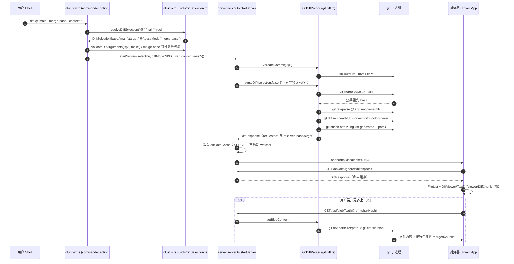
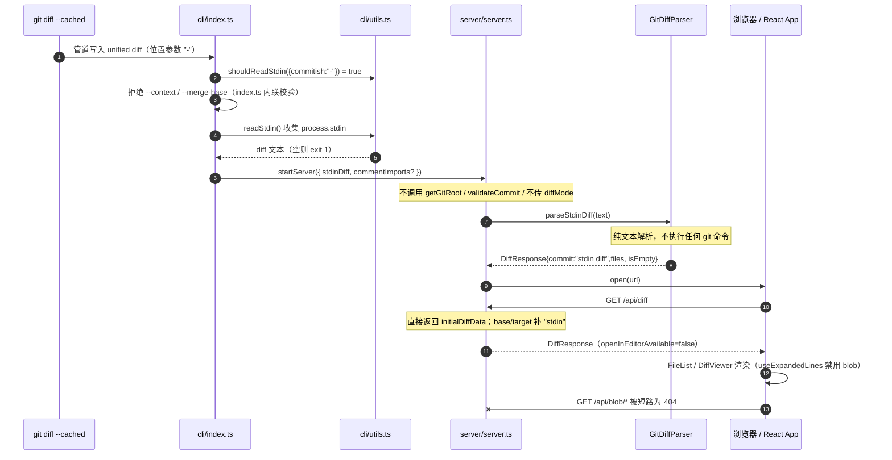
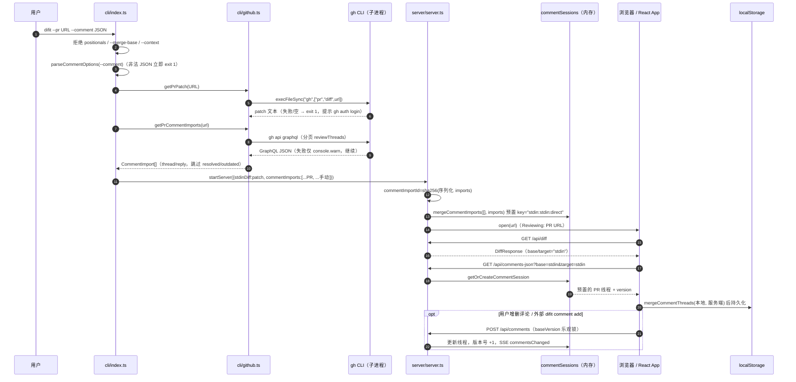

# difit 架构级代码走读：从三条命令理解端到端调用链

> 面向新成员的代码导览。基准版本：`package.json` v5.0.12。
>
> 约定：
>
> - **【代码已确认】** 表示结论可直接由引用文件中的函数/类代码推出；
> - **【合理推断】** 表示代码没有直接断言、属于基于代码行为的工程推断，不可当作事实引用。
> - 行号随代码演进可能漂移，请以函数/类名为准定位。
> - 三条主线命令：
>   1. `difit @ main --merge-base --context 5`（Git revision 模式，merge-base + 自定义上下文行数）
>   2. `git diff --cached | difit -`（显式 stdin 模式，审查暂存区 diff 文本）
>   3. `difit --pr https://github.com/owner/repo/pull/123 --comment '<合法 JSON>'`（PR patch 模式，复用 stdin 管线 + 导入 GitHub 评论）

---

## 1. 全局架构与三条命令的分叉点

difit 是一个「本地 CLI + 本地 Express 服务 + React 单页应用」的单体工具：

- **CLI 层**：`src/cli/index.ts` 用 commander 解析参数，决定输入来源（Git / stdin / GitHub PR），随后调用 `startServer`。
- **服务层**：`src/server/server.ts` 启动 Express，挂载 `/api/diff`、`/api/blob/*`、评论、SSE 等路由；diff 文本由 `src/server/git-diff.ts` 的 `GitDiffParser` 生成或解析；文件监听由 `src/server/file-watcher.ts` 的 `FileWatcherService` 负责。
- **前端层**：生产构建产物在 `dist/client`，入口 `src/client/main.tsx` → `src/client/App.tsx`；`App` 通过 `/api/diff` 拉取 `DiffResponse`，文件列表用 `src/client/components/FileList.tsx`，逐文件渲染用 `src/client/components/DiffViewer.tsx` → `src/client/viewers/TextDiffViewer.tsx` → `src/client/components/DiffChunk.tsx` / `DiffLineRow.tsx`。
- **共享类型**：`src/types/diff.ts`（`DiffSelection`、`DiffResponse`、`DiffFile`/`DiffChunk`/`DiffLine`、评论类型）与 `src/types/watch.ts`（`DiffMode`、SSE 事件）。

三条命令在 CLI 层的唯一分叉，是 `src/cli/index.ts` 的 action 回调中对「输入来源」的判定顺序【代码已确认，函数：commander `.action(async (commitish, compareWith, options) => {...})`】：

1. 先做 `--context` 整数校验、`--background` 处理、`--comment` JSON 解析；
2. 若 `options.pr` 存在 → **PR patch 模式**（`getPrPatch`，产出 patch 字符串赋给 `stdinDiff`）；
3. 否则用 `shouldReadStdin(...)` 判定 → 命中则读管道得到 `stdinDiff`（**stdin 模式**）；
4. 若 `stdinDiff` 有值（含 PR），调用 `startServer({ stdinDiff, ... })` 并提前 `return`；
5. 否则检测 Git 根目录、构造 `DiffSelection`，调用 `startServer({ selection, diffMode, repoPath, ... })`（**Git revision 模式**）。

因此 PR patch 模式本质上是「在 CLI 层把 patch 准备好，然后复用 stdin 管线」【代码已确认，`index.ts` 中 `if (stdinDiff) { ... startServer({ stdinDiff, ... }); ... return; }` 分支同时覆盖 `--pr` 与管道输入】。

---

## 2. 命令一：`difit @ main --merge-base --context 5`

### 2.1 参数解析与 selection 构造

- commander 定义于 `src/cli/index.ts`：两个位置参数 `[commit-ish]`（默认 `'HEAD'`）和 `[compare-with]`；选项 `--merge-base`、`--context <lines>`（`parseInt`）等【代码已确认，`.argument(...)` / `.option(...)` 链】。
- 本命令中 `commitish='@'`（Git 中 `@` 即 `HEAD`，由 `src/cli/utils.ts` 的 `validateCommitish` 显式允许：`/^@$/`）、`compareWith='main'`、`options.mergeBase=true`、`options.context=5`。
- `resolveDiffSelection('@', 'main', true)`（`src/cli/index.ts`）：因为 `compareWith` 存在，`baseCommitish='main'`，target 为 `'@'`，最终由 `src/utils/diffSelection.ts` 的 `createDiffSelection('main', '@', 'merge-base')` 产出：
  `{ baseCommitish: 'main', targetCommitish: '@', baseMode: 'merge-base' }`。
- 额外校验：`index.ts` 中 `if (options.mergeBase && isSpecialArg(selection.baseCommitish))` 会拒绝把 `working/staged/.` 解析成 base 的情形——本命令 base 是 `main`，通过。
- 语义校验：`validateDiffArguments(target, base)`（`src/cli/utils.ts`）校验两个 commit-ish 的格式、特殊参数位置、不允许自己比自己；`@` 与 `main` 通过。
- 监听模式：`determineDiffMode(selection, compareWith)`（`index.ts`）中 `compareWith && targetCommitish !== 'HEAD' && targetCommitish !== '.'` 才是 `SPECIFIC`；此处 `targetCommitish` 是字面量 `'@'`，不等于字符串 `'HEAD'`，所以返回 `DiffMode.SPECIFIC`【代码已确认】。**【合理推断】** `@` 与 `HEAD` 语义等价但字面不等，导致模式判定依赖 `shouldReadStdin` 之外的字面比较；不过 `SPECIFIC` 对二者效果相同（都不监听），所以无用户可见差异。

### 2.2 服务启动与 diff 生成（含 merge-base 解析、blob 上下文）

- `startServer`（`src/server/server.ts`）：
  - `repositoryPath = resolve(options.repoPath ?? process.cwd())`，`repositoryId = sha256(repositoryPath)`（用于前端 localStorage 隔离）。
  - 非 stdin 模式先 `await parser.validateCommit(initialSelection.targetCommitish)`：内部 `git show @ --name-only`（`src/server/git-diff.ts` 的 `validateCommit`），失败则抛错，CLI 最外层 catch 打印 `Error: ...` 后 `process.exit(1)`。
  - 立刻调用 `parser.parseDiff(selection, false, 5)` 生成首屏数据（用于 `isEmpty` 判定和缓存预热），并写入 `diffDataCache`（LRU，上限 `MAX_DIFF_CACHE_ENTRIES = 8`）。
- `GitDiffParser.parseDiff(selection, ignoreWhitespace, contextLines)`（`src/server/git-diff.ts`）：
  1. `validateDiffArguments(target, base)` 再次校验；
  2. `resolveBaseCommitish(selection)`：`baseMode==='merge-base'` 时执行 **`git merge-base <targetRef> main`**（`this.git.raw(['merge-base', targetRef, selection.baseCommitish])`），把符号 base 替换成真正的公共祖先短哈希；其中 target 侧的 ref 由 `getMergeBaseTargetRef`（`src/utils/diffSelection.ts`）把 `.`/`staged`/`working` 归一到 `HEAD`，本命令 target 是 `@`，直接用 `'@'`；
  3. 两个参数都是普通 commit-ish：分别 `git rev-parse @`、`git rev-parse <merge-base 结果>`，组装 `diffArgs=[baseHash, targetHash]`；
  4. 追加 `-w`（仅当忽略空白）、`` `-U${contextLines}` ``（本命令为 `-U5`）、`--no-ext-diff`、`--color=never`；
  5. **单次** `this.git.diff(diffArgs)`（simple-git 封装的 `git diff`）取 unified diff 文本；
  6. `parseUnifiedDiff` → `parseFileBlock` → `parseChunks` 生成 `DiffFile[] / DiffChunk[] / DiffLine`；`markGitattributesGeneratedFiles` 再通过 **`git check-attr -z linguist-generated`**（分块 200 个路径）标记生成文件；
  7. 返回的 `DiffResponse` 同时带「请求值」`requestedBaseCommitish='main'`、`requestedTargetCommitish='@'`、`requestedBaseMode='merge-base'` 和「解析值」`baseCommitish=<merge-base 短哈希>`、`targetCommitish=<HEAD 短哈希>`。
  - 任何 git/解析异常都被 catch 包成 `Failed to parse diff for @ vs main: ...` 抛出；`/api/diff` 路由把它转成 HTTP 500 JSON【代码已确认，`server.ts` 的 `app.get('/api/diff')` catch】。
- 端口：`startServerWithFallback`（`server.ts`）默认 4966，`EADDRINUSE` 时递归尝试 +1。
- 文件监听：`DiffMode.SPECIFIC` 下 `FileWatcherService.start`（`src/server/file-watcher.ts`）直接打印「file watching disabled」并返回，`MODE_WATCH_CONFIGS[SPECIFIC].watchPaths=[]`，不订阅任何路径。
- 浏览器：`initialDiffData.isEmpty` 为真则不自动打开；否则 `open(url)`（本命令有变更时自动开）。

### 2.3 前端渲染

- 浏览器加载 `dist/client` 静态资源（生产模式 `express.static(join(__dirname,'..','client'))`），`src/client/main.tsx` 挂载 `App`。
- `App.fetchDiffData`（`src/client/App.tsx`）请求 `/api/diff?ignoreWhitespace=...&base=main&target=@&baseMode=merge-base`（base/target/baseMode 仅在版本选择器选中后才带；首屏通常只带 `ignoreWhitespace`，服务端用 `currentSelection` 兜底）。用 `AbortController` + 自增 `requestId` 丢弃过期响应。
- 服务端 `/api/diff`：stdin 模式不重算；Git 模式先查 `diffDataCache`（键 = `base:target:baseMode \0 ignoreWhitespace`，见 `createDiffCacheKey`），未命中才 `parseDiff` 并回填，同时清空 `generatedStatusCache`。
- 前端拿到 `DiffResponse` 后：
  - `resolvedSelection = createDiffSelection(data.baseCommitish, data.targetCommitish, data.requestedBaseMode)`（用**解析后的短哈希**，但保留 merge-base 标记）；
  - `FileList`（`src/client/components/FileList.tsx`）消费 `diffData.files`（`status/additions/deletions/path`）渲染左侧文件树与计数；
  - 主区域 `diffData.files.map(...)` 对已进入渲染窗口的文件挂 `DiffViewer`（懒渲染由 `useLazyDiffRendering` 控制，`renderedFilePaths` 之外的文件只注册占位容器）；
  - `DiffViewer` 经 `getViewerForFile`（`src/client/viewers/registry.ts`）为文本文件选择 `TextDiffViewer`，后者遍历 `mergedChunks`（`useExpandedLines.getMergedChunks` 在原始 chunks 上插入「展开上下文」结果），逐 chunk 渲染 `DiffChunk`（统一视图）或 `SideBySideDiffChunk`（分列视图），每行交给 `DiffLineRow`，消费 `DiffLine.type/content/oldLineNumber/newLineNumber`。
- **展开上下文（blob）**：用户点击展开按钮时，`useExpandedLines.expandLines`（`src/client/hooks/useExpandedLines.ts`）对 old/new 两侧分别请求 `/api/blob/<path>?ref=<base|target>`，服务端路由经 `parseRepositoryRelativePath` 防穿越校验后调 `GitDiffParser.getBlobContent`：普通 ref 走 **`git rev-parse <ref>:<path>` → `git cat-file blob <hash>`**（`execFileSync`，二进制安全，10MB 上限），`staged` 走 `git show :<path>`，`working/.` 直接读文件系统（再做一次 realpath 前缀校验）。合并后的 chunk 结构由 `src/client/utils/mergedChunks.ts` 的 `buildMergedChunksState` 缓存。

### 2.4 Mermaid 时序图

---

## 3. 命令二：`git diff --cached | difit -`

### 3.1 stdin 判定与输入读取

- 显式 `-`：`src/cli/utils.ts` 的 `shouldReadStdin({ commitish, hasPositionalArgs, hasPrOption })` 第一条分支 `if (options.commitish === '-') return true;`。即 `-` 是强制 stdin 的位置参数【代码已确认】。
- 隐式管道也成立：无位置参数、非 `--pr` 时，`detectStdinSource()`（`fstatSync(0)` 判断 FIFO/file/socket，否则视为 tty）为 `pipe|file|socket` 即读 stdin。所以 `git diff | difit` 与 `difit -` 等价；交互式终端直接运行 `difit` 不会阻塞等待输入【代码已确认】。
- 互斥校验在 `src/cli/index.ts` action 内：stdin 分支显式拒绝 `--context`（`Error: --context option cannot be used with stdin diff`）与 `--merge-base`（`Error: --merge-base option cannot be used with stdin diff`），随后 `readStdin()`（`src/cli/utils.ts`，收集 `process.stdin` 的 Buffer 拼成 UTF-8），空内容直接退出 `Error: No diff content received from stdin`。
- 注意：`--comment` 的解析发生在输入来源判定**之前**，非法 JSON 会更早失败（`parseCommentOptions` → `parseCommentImportValue`，JSON.parse 异常被转成 `Error: Invalid --comment JSON`）。

### 3.2 stdin 模式的服务端行为（不校验 commit、不读 blob、不监听）

`startServer({ stdinDiff, ... })` 与 Git 模式的差异均在 `src/server/server.ts` 中【代码已确认】：

- **跳过 commit 校验**：`if (!options.stdinDiff) { await parser.validateCommit(...) }`——stdin 下即使 cwd 不是 Git 仓库也能启动。CLI 层在 stdin 分支提前 `return`，连 `getGitRoot()`（`git rev-parse --show-toplevel`）都不会执行。
- **首屏数据**：`parser.parseStdinDiff(stdinDiff)`（`src/server/git-diff.ts`）。它只做纯文本解析：复用 `parseUnifiedDiff`（先按 `diff --git ` 切块，失败再用 `splitPlainUnifiedDiff` 解析无 `diff --git` 头的裸 unified diff），返回 `{ commit: 'stdin diff', files, isEmpty }`，**不执行任何 git 命令**。
- **没有 diff 缓存与重算**：`/api/diff` 中 `if (!options.stdinDiff)` 包住缓存与 `parseDiff`；stdin 下每次请求都返回同一个 `initialDiffData`，`ignoreWhitespace` 参数被忽略。
- **响应身份字段**：`baseCommitish`/`targetCommitish` 缺失时在路由里补成 `'stdin'`（`responseDiffData.baseCommitish ?? 'stdin'`），`requested*` 同样兜底为 `'stdin'`；`openInEditorAvailable: !options.stdinDiff` 为 `false`。
- **blob / line-count / generated-status / revisions / open-in-editor 全部禁用**：对应路由在 `options.stdinDiff` 时分别返回 404 或 400（`Blob content not available for stdin diff` 等）。
- **不启动文件监听**：CLI 在 stdin 分支根本不传 `diffMode`，`if (options.diffMode)` 为假，`FileWatcherService.start` 不被调用；前端 SSE 仍会连接 `/api/watch`，但 `addClient` 发出的 `connected` 事件里 diffMode 是默认值，且永远不会收到 `reload`【代码已确认；前端「永不热重载」属合理推断】。
- `repositoryId` 仍然按 cwd 绝对路径计算（`sha256(resolve(process.cwd()))`），因此同一目录下的 stdin 评论与 Git 模式评论在 localStorage 中处于同一仓库分区，但 diff 上下文键是 `stdin:stdin:direct`，不会互相串（见第 6 节）。

### 3.3 前端消费

- 与命令一相同的 React 渲染链；`useExpandedLines` 内 `const isStdinDiff = baseCommitish === 'stdin' || targetCommitish === 'stdin'`，`ensureFileContent` 直接 `return null`，所以「展开上下文」按钮在 stdin 模式不会发起 blob 请求【代码已确认，`src/client/hooks/useExpandedLines.ts`】。
- 能展示的行数完全由管道输入的 diff 文本决定：`git diff --cached` 默认 `-U3`，且 `--context` 在该模式被禁用，这是「stdin 不能自定义上下文」的用户可见后果。
- 图片/Markdown/Notebook 等需要拉取 blob 的特殊 viewer 在 stdin 下也无法获得原始文件，只能呈现文本差异【代码已确认：blob 路由 404；viewer 层面的降级表现属合理推断】。

### 3.4 Mermaid 时序图

---

## 4. 命令三：`difit --pr https://github.com/owner/repo/pull/123 --comment '<合法 JSON>'`

### 4.1 PR 模式的参数互斥与 GitHub CLI 调用

全部在 `src/cli/index.ts` action 与 `src/cli/github.ts` 中【代码已确认】：

- 互斥三连（先于任何网络调用）：
  - `if (options.pr) { if (commitish !== 'HEAD' || compareWith) → 'Error: --pr option cannot be used with positional arguments' }`（默认位置参数 `HEAD` 不算显式传参，所以裸 `difit --pr URL` 合法）；
  - `options.mergeBase` → `Error: --merge-base option cannot be used with --pr`；
  - `options.context !== undefined` → `Error: --context option cannot be used with --pr`。
- **patch 获取（硬失败）**：`getPrPatch(options.pr)`（`src/cli/github.ts`）用 `execFileSync('gh', ['pr','diff',prArg])` 同步取 patch；空输出抛 `No diff content returned from gh pr diff`；任何 gh 错误经 `formatGhCommandError` 提取 stderr 并附 `Try: gh auth login`，回到 `index.ts` 打印 `Error resolving PR: ...` 后 `exit(1)`。注意这里**不校验 URL 形态**（`gh pr diff` 直接吃参数）；URL 解析只用于评论 GraphQL 查询。
- **评论获取（软失败）**：`await getPrCommentImports(options.pr)`：
  - `parseGitHubPrUrl` 解析 `owner/repo/pull/number` 与 hostname（支持 GitHub Enterprise 主机名），非法 URL 抛 `Invalid GitHub PR URL`；
  - 分页循环调用 `gh api graphql --hostname <host> -f query=... -F owner=... -F repo=... -F number=... [-F endCursor=...]`（每页 100 个 review thread、每个 thread 100 条 comment）；
  - `parsePrCommentImportsResponse` + `toCommentImportsForThread` 把 thread 转成 `CommentImport[]`：跳过 `isResolved`、`isOutdated`、`subjectType !== 'LINE'` 的线程；`diffSide RIGHT` 用 `line/startLine` 映射到 `side:'new'`，`LEFT` 用 `originalLine/originalStartLine` 映射到 `side:'old'`；多行范围生成 `{start,end}`，字段缺失/矛盾时 `warnPrCommentImport` 跳过该线程；首条评论 `type:'thread'`，其余按 createdAt 排序后为 `type:'reply'`；
  - 这一步的任何失败只产生 `Warning: Failed to load PR review comments: ...`，**不影响** patch 审查。
- 手动 `--comment` 先经 `parseCommentOptions` → `normalizeCommentImports`（`src/utils/commentImports.ts`，校验 `type/filePath/position.side/position.line/body/createdAt` 等，非法即抛错退出）。最终顺序是 `commentImports = [...prCommentImports, ...manualCommentImports]`（手动评论在后，合并时同键覆盖优先）。

### 4.2 复用 stdin 管线 + 评论会话预置

- `stdinDiff = patch`、`stdinReviewLabel = PR URL` 后，PR 与管道输入走**同一个** `if (stdinDiff) startServer({stdinDiff,...})` 分支；因此第 3.2 节的所有限制（不校验仓库、不读 blob、不监听、revisions 不可用）对 PR 模式同样成立。
- 评论导入在服务端被预置进内存会话，而不是靠前端二次提交【代码已确认，`src/server/server.ts`】：
  - `commentImportId = sha256(serializeCommentImports(initialCommentImports))`；
  - `mergeCommentImports([], initialCommentImports).threads` 生成首批线程，写入 `commentSessions` 中 key 为 `createCommentSessionKey(currentCommentSelection)` 的会话（PR 模式下解析出的 selection 是 `stdin:stdin`，direct 模式）；
  - `/api/diff` 返回体里的 `commentImports/commentImportId` 仅在 `shouldIncludeCommentImports` 为真时携带（stdin 恒真；Git 模式要求 selection 与初始 selection 相同）。**【代码已确认】** 当前前端代码（`src/client/**`）没有任何地方读取响应的 `commentImports` 字段（全仓搜索仅命中服务端与类型定义）；实际生效路径是前端启动后 `App.tsx` 的 bootstrap effect 调 `GET /api/comments-json?base=stdin&target=stdin` 拉到预置线程。**【合理推断】** 响应中的 `commentImports` 字段是为外部/静态消费方保留的载荷，主 SPA 不消费它。
- 前端 bootstrap（`src/client/App.tsx`）：以 `commentsContextKey = repositoryId:base:target:baseMode` 为去重键，每个上下文只做一次：`fetchServerThreads()` 拿服务端线程，与本地 localStorage 线程做 `mergeCommentThreads`（保留本地新增），`replaceThreads` 落回 localStorage（`useDiffComments.saveThreads` → `StorageService.saveCommentThreads`），再按需把合并结果 POST 回 `/api/comments`。
- `POST /api/comments` 支持乐观并发：客户端在 body 带 `baseVersion`，过期时服务端 `mergeCommentThreads` 合并而非覆盖，返回 `merged:true`，客户端采纳服务端版本（`syncThreadsToServer` 中 `replaceThreads(result.threads)`）。SSE `commentsChanged` 事件（`updateCommentSession` 触发）用于多标签/`difit comment add` 等外部写入方的实时通知。

### 4.3 Mermaid 时序图

---

## 5. 三种模式的差异对照

| 维度                                                 | 普通 Git diff（命令一）                                                                                                                                                              | stdin diff（命令二）                                                                                         | PR patch（命令三）                                                                                 |
| ---------------------------------------------------- | ------------------------------------------------------------------------------------------------------------------------------------------------------------------------------------ | ------------------------------------------------------------------------------------------------------------ | -------------------------------------------------------------------------------------------------- |
| 入口判定                                             | `index.ts`：无 `--pr`、`shouldReadStdin` 为假，走 git 分支                                                                                                                           | `shouldReadStdin`（`src/cli/utils.ts`）：commitish 为 `-` 或无位置参数且 stdin 是 pipe/file/socket           | `options.pr` 为真（`index.ts`）；patch 经 `getPrPatch` 取出后赋给 `stdinDiff`                      |
| 是否要求在 Git 仓库内                                | 是。CLI 调 `getGitRoot()`（失败仅令 `repoPath=undefined` 退回 cwd）；服务端 `validateCommit` 再查 `git show`/`git status`，失败即启动中止【代码已确认，`server.ts` + `git-diff.ts`】 | **否**。CLI 提前 return，不调 `getGitRoot`；服务端跳过 `validateCommit`【代码已确认】                        | **否**。复用 stdin 管线；只要求 `gh` 可用且已认证                                                  |
| 是否校验 commit 存在                                 | 是：`validateCommit` + `parseDiff` 内 `git rev-parse`                                                                                                                                | 否                                                                                                           | 否（patch 已包含完整 diff；URL 合法性仅评论查询需要）                                              |
| diff 数据来源                                        | `simple-git` 的 `git diff`（`GitDiffParser.parseDiff`），单次调用                                                                                                                    | `GitDiffParser.parseStdinDiff` 纯文本解析管道内容                                                            | `execFileSync('gh',['pr','diff',...])`（`src/cli/github.ts`），之后与 stdin 完全相同               |
| `--context N`                                        | 支持，变成 `git diff -UN`                                                                                                                                                            | **禁止**（index.ts 报错退出）                                                                                | **禁止**（index.ts 报错退出）；行数由 GitHub patch 决定                                            |
| `--merge-base`                                       | 支持：`git merge-base <targetRef> <base>` 解析公共祖先（`resolveBaseCommitish`）                                                                                                     | **禁止**                                                                                                     | **禁止**                                                                                           |
| base/target 身份                                     | requested=`main`/`@`，resolved=短哈希；`requestedBaseMode='merge-base'`                                                                                                              | 路由兜底为 `'stdin'`/`'stdin'`，无 baseMode                                                                  | 同 stdin（`'stdin'`）                                                                              |
| blob 读取/展开上下文                                 | 支持：`/api/blob` → `git cat-file blob`、`git show :path` 或直接读工作区                                                                                                             | 不支持：blob/line-count 路由 404，前端 `isStdinDiff` 短路                                                    | 不支持（同 stdin）                                                                                 |
| revisions 选择器 / generated-status / open-in-editor | 支持（generated-status 有 60s TTL 缓存）                                                                                                                                             | 路由 400/404；`openInEditorAvailable=false`                                                                  | 同 stdin                                                                                           |
| diff 缓存                                            | 有：`diffDataCache`（LRU 8，键含 selection + ignoreWhitespace），文件变更时整体失效                                                                                                  | 无（恒定返回 `initialDiffData`）                                                                             | 无                                                                                                 |
| 文件监听                                             | 由 `determineDiffMode` 决定（命令一为 SPECIFIC，不监听；`working/staged/.`/默认 HEAD 模式才监听，见 5.1）                                                                            | 从不启动（不传 `diffMode`）                                                                                  | 从不启动                                                                                           |
| 评论来源                                             | `--comment` 手动导入 + 本地 localStorage + 运行期会话                                                                                                                                | 同左                                                                                                         | PR review threads（GraphQL，软失败）+ `--comment`，顺序 PR 在前                                    |
| 评论上下文键                                         | `sha256(repo路径)` + 解析后短哈希键，merge-base 带后缀                                                                                                                               | `sha256(cwd)` + `stdin:stdin:direct`                                                                         | 同 stdin（不同仓库目录下审查同一 PR 会落到不同 localStorage 分区）【代码已确认；后一句为合理推断】 |
| 外部命令失败处理                                     | git 失败 → `parseDiff` 包装错误，首屏启动失败 exit 1；`/api/diff` 运行期失败返回 500                                                                                                 | stdin 空内容 exit 1；解析器对无法识别的文本产出空 files（页面显示空 diff）【代码已确认；页面文案属合理推断】 | patch 失败硬退出；评论失败仅 warning                                                               |

### 5.1 文件监听的启动条件（代码已确认）

- 唯一启动点：`src/server/server.ts` 中 `if (options.diffMode) { await fileWatcher.start(options.diffMode, repositoryPath, 300, invalidateCache) }`，启动失败只 warn 不致命。
- `diffMode` 只在 git 分支由 `determineDiffMode`（`src/cli/index.ts`）计算：
  - `compareWith` 存在且 target 既不是 `HEAD` 也不是 `.` → `SPECIFIC`（不监听）；
  - target 为 `working` → `WORKING`（监听工作区 + `.git`，changeType=file）；
  - `staged` → `STAGED`（只监听 `.git`，关心 `index/HEAD`，changeType=staging）；
  - `.` → `DOT`（监听工作区 + `.git`，只认 `.git/HEAD`，changeType=commit）；
  - 其余（如默认 `HEAD^..HEAD`）→ `DEFAULT`（只监听 `.git/HEAD`，changeType=commit）。
- 监听配置表 `MODE_WATCH_CONFIGS` 与事件过滤（`isRelevantGitFile`、`.gitignore` 过滤、300ms 防抖）都在 `src/server/file-watcher.ts`；触发后先 `invalidateCache()`（清 `diffDataCache`、`generatedStatusCache`、resolved commit 5s TTL 缓存）再通过 `/api/watch` SSE 推 `reload`。前端 `src/client/hooks/useFileWatch.ts` 收到后显示 reload 按钮（断线最多重连 5 次、每次间隔 3s），由 `App` 重新调用 `fetchDiffData`。

### 5.2 评论导入与本地持久化如何区分 diff 上下文

- 运行期（服务端内存）：`commentSessions: Map<key, {threads, version}>`，键由 `createCommentSessionKey(selection)` → `getDiffSelectionKey`（`src/utils/diffSelection.ts`）生成，格式 `baseCommitish:targetCommitish:normalizeBaseMode(baseMode)`；merge-base 与 direct 即使解析到同一个 base 哈希，也因第三段不同而分成两个会话。请求侧通过 query `base/target/baseMode` 选择会话（`getCommentSelectionFromQuery`，缺省回落到 `currentCommentSelection`，该值由每次 `/api/diff` 的**解析结果**更新）。
- 浏览器本地（localStorage）：`src/client/services/StorageService.ts`
  - 仓库分区：`difit-storage-v1/<repositoryId>/<contextKey>`，`repositoryId` 来自服务端 `DiffResponse.repositoryId`（仓库绝对路径的 sha256），缺失时退化为 `__default__` 路径；
  - 上下文键：`generateStorageKey` 对 base/target 做百分号式编码，`baseMode==='merge-base'` 时追加 `-merge-base` 后缀；
  - 动态引用归一：`normalizeStorageBase/Target` + `normalizeCommitish` 把 `HEAD`/`@`（需 `currentCommitHash`，即 `DiffResponse.commit` 参与）归到当前提交哈希、`working/.`→`WORKING`、`staged`→`STAGED`，让「同一条命令在新提交后」读到与提交绑定的历史评论；无法归一的符号引用（如裸 `HEAD^`）按字面量成键并在控制台告警可能碰撞；
  - 存储 schema 为 v2（`DiffContextStorage`：`threads/viewedFiles/appliedCommentImportIds`），读取时对 v1（`LegacyDiffContextStorage`）即时迁移。
- 前端上下文身份：`App.tsx` 的 `commentsContextKey = repositoryId:resolvedSelectionKey`，切换 base/target/baseMode/仓库都会触发一次新的 bootstrap；`--clean` 经 `DiffResponse.clearComments` 让 `clearAllComments({resetAppliedCommentImportIds:true})` 与 `clearViewedFiles()` 只在当前上下文执行一次（`hasCleanedRef` 防重复）。

---

## 6. 参数互斥与校验规则总表（每条规则对应真实校验位置）

| #   | 规则                                                                                                                                                                                | 校验文件与函数（代码已确认）                                                                                                                                                                               | 失败表现                                                                                |
| --- | ----------------------------------------------------------------------------------------------------------------------------------------------------------------------------------- | ---------------------------------------------------------------------------------------------------------------------------------------------------------------------------------------------------------- | --------------------------------------------------------------------------------------- | ------------------------------------------------------------------------- | ---------------------------------------------------------------------------- |
| 1   | `--pr` 不能与任何显式位置参数（commit-ish 或 compare-with）同用；默认 `HEAD` 不算                                                                                                   | `src/cli/index.ts`，commander action 内 `if (options.pr) { if (commitish !== 'HEAD'                                                                                                                        |                                                                                         | compareWith) ...}`                                                        | stderr `Error: --pr option cannot be used with positional arguments`，exit 1 |
| 2   | `--merge-base` 不能与 `--pr` 同用                                                                                                                                                   | `src/cli/index.ts`，PR 分支 `if (options.mergeBase)`                                                                                                                                                       | `Error: --merge-base option cannot be used with --pr`，exit 1                           |
| 3   | `--context` 不能与 `--pr` 同用                                                                                                                                                      | `src/cli/index.ts`，PR 分支 `if (options.context !== undefined)`                                                                                                                                           | `Error: --context option cannot be used with --pr`，exit 1                              |
| 4   | `--context` 不能与 stdin diff 同用                                                                                                                                                  | `src/cli/index.ts`，stdin 分支同名判断                                                                                                                                                                     | `Error: --context option cannot be used with stdin diff`，exit 1                        |
| 5   | `--merge-base` 不能与 stdin diff 同用                                                                                                                                               | `src/cli/index.ts`，stdin 分支 `if (options.mergeBase)`                                                                                                                                                    | `Error: --merge-base option cannot be used with stdin diff`，exit 1                     |
| 6   | `--context` 必须是非负整数                                                                                                                                                          | `src/cli/index.ts`，action 最前面 `Number.isInteger(options.context)                                                                                                                                       |                                                                                         | options.context < 0`判断（commander 用`parseInt` 转换，`NaN` 也在此被拦） | `Error: --context must be a non-negative integer`，exit 1                    |
| 7   | stdin 必须收到非空内容                                                                                                                                                              | `src/cli/index.ts` 调 `readStdin()`（`src/cli/utils.ts`）后检查 `stdinDiff.trim()`                                                                                                                         | `Error: No diff content received from stdin`，exit 1                                    |
| 8   | stdin 仅在 `commitish==='-'`、或无位置参数且 stdin 源为 pipe/file/socket 时读取；有任意位置参数（除 `-`）或 `--pr` 时不读                                                           | `src/cli/utils.ts` `shouldReadStdin` + `detectStdinSource`（`fstatSync(0)`）                                                                                                                               | 不报错：管道内容被忽略，按 git 模式执行【代码已确认】                                   |
| 9   | `--merge-base` 解析出的 base 不能是特殊参数 `working/staged/.`                                                                                                                      | `src/cli/index.ts`：`options.mergeBase && isSpecialArg(selection.baseCommitish)`（`isSpecialArg` 同文件）                                                                                                  | `Error: --merge-base requires a commit-ish base, but resolved base was "..."`，exit 1   |
| 10  | target/base 必须符合 commit-ish 语法（SHA/HEAD/@/合法分支标签名/可剥离的 `^~n` 后缀；`.`/`working`/`staged` 特判放行）                                                              | `src/cli/utils.ts` `validateDiffArguments` → `validateCommitish`/`isValidBranchName`/`stripRevisionSuffix`；CLI 在 `index.ts` 调一次，`GitDiffParser.parseDiff` 内再调一次                                 | CLI：`Error: Invalid target/base commit-ish format`；服务端：500 JSON                   |
| 11  | 特殊参数只能做 target；唯一例外是 target=`working` 时允许 base=`staged`                                                                                                             | `src/cli/utils.ts` `validateDiffArguments` 中 `specialArgs` 分支                                                                                                                                           | `Error: Special arguments (working, staged, .) are only allowed as target, not base...` |
| 12  | target 与 base 不能相同                                                                                                                                                             | `src/cli/utils.ts` `validateDiffArguments`                                                                                                                                                                 | `Error: Cannot compare X with itself`                                                   |
| 13  | `working` 作为 target 时只能与 `staged` 比较；跨提交比较未提交改动应使用 `.`                                                                                                        | `src/cli/utils.ts` `validateDiffArguments` 末段                                                                                                                                                            | 错误信息明确提示改用 `.`                                                                |
| 14  | Git 模式下 target 提交必须真实存在（特殊参数则要求仓库可用）                                                                                                                        | `src/server/git-diff.ts` `GitDiffParser.validateCommit`（`git show <commit> --name-only` / `git status`），由 `src/server/server.ts` `startServer` 启动时调用                                              | 抛 `Invalid or non-existent commit: ...`，CLI 最外层 catch 后 exit 1                    |
| 15  | `--comment` 每个值必须是合法 JSON（对象或数组），且字段满足 `type/filePath/position/body` 等约束                                                                                    | `src/cli/index.ts` 调 `parseCommentOptions`（`src/cli/utils.ts`）→ `parseCommentImportValue`/`normalizeCommentImports`（`src/utils/commentImports.ts`）                                                    | `Error: Invalid --comment JSON` 或 `Error: Invalid comment import field: ...`，exit 1   |
| 16  | 非 stdin 模式的文件类 API（blob/line-count/generated-status/open-in-editor）只接受仓库内相对路径：拒绝绝对路径、前导 `/`、任何 `..` 段，并做 `resolve(repositoryPath,...)` 前缀校验 | `src/server/server.ts` `parseRepositoryRelativePath`；blob 工作区读取还有 `src/server/git-diff.ts` `getBlobContent` 内的 realpath 二次校验，git ref 路径经 `GitDiffParser.normalizeRepositoryRelativePath` | 400 `Invalid file path` / `File path outside repository`；blob 异常最终 404             |

补充：`--comment` 本身**没有**互斥对象，三种模式均可重复传入（commander 的 collect 函数把多次出现累积成数组）；PR 模式下它与 GitHub 评论合并，手动项排在数组后部【代码已确认，`index.ts` 的 `.option('--comment <json>', ..., (v, prev) => [...prev, v], [])` 与合并顺序】。

---

## 7. 请求数据生命周期表

字段在「CLI → 服务端 `/api/diff` → 前端」三段中的来源、转换位置与最终消费者。类型定义均在 `src/types/diff.ts`。

| 字段                                                                                             | 初始来源                                                                                                                      | 关键创建/转换位置（文件 · 函数）                                                                                                                                                                   | 前端最终消费者                                                                                                                                                              |
| ------------------------------------------------------------------------------------------------ | ----------------------------------------------------------------------------------------------------------------------------- | -------------------------------------------------------------------------------------------------------------------------------------------------------------------------------------------------- | --------------------------------------------------------------------------------------------------------------------------------------------------------------------------- |
| `DiffSelection.baseCommitish`（请求值）                                                          | 位置参数 `[compare-with]`；缺省时由 `resolveDiffSelection` 推导（`working`→`staged`、特殊参数→`HEAD`、普通 commit→`commit^`） | `src/cli/index.ts` `resolveDiffSelection`；`src/utils/diffSelection.ts` `createDiffSelection`                                                                                                      | `App.tsx`：版本选择器初值、评论/已读上下文；`server.ts` `getCommentSelectionFromQuery`                                                                                      |
| `DiffSelection.targetCommitish`                                                                  | 位置参数 `[commit-ish]`，默认 `'HEAD'`；stdin 模式不存在 selection                                                            | 同上                                                                                                                                                                                               | 同上；`GitDiffParser` 选择 diff 参数分支                                                                                                                                    |
| `DiffSelection.baseMode`                                                                         | `--merge-base` 开关；direct 时该字段被省略（`normalizeBaseMode` 兜底 `'direct'`）                                             | `src/utils/diffSelection.ts` `createDiffSelection`/`normalizeBaseMode`；merge-base 实际解析在 `src/server/git-diff.ts` `resolveBaseCommitish`（`git merge-base`）                                  | 评论 query `baseMode`、localStorage 键后缀、版本选择器 UI（`App.tsx` `resolvedSelection`）                                                                                  |
| `DiffResponse.requestedBaseCommitish` / `requestedTargetCommitish` / `requestedBaseMode`         | 用户原始输入（保留 `main`/`@`/`merge-base` 形态）                                                                             | `GitDiffParser.parseDiff` 返回；`server.ts` `/api/diff` 对 stdin 兜底 `'stdin'`                                                                                                                    | `App.tsx` `fetchDiffData`：回填 `selectedRevision`、`currentRequestedBaseModeRef`                                                                                           |
| `DiffResponse.baseCommitish` / `targetCommitish`（解析值）                                       | git rev-parse 的 7 位短哈希；特殊模式为 `staged` 文案或保留 `.`/`working`；stdin 为 `'stdin'`                                 | `git-diff.ts` `parseDiff`（`shortHash`/`createCommitRangeString`）；`server.ts` `createResolvedCommentSelection`                                                                                   | `App.tsx` `resolvedSelection`（评论上下文主键）；`useExpandedLines` 的 blob `ref`；`FileWatcherService` 不消费                                                              |
| `DiffResponse.commit`                                                                            | `parseDiff` 组装的人类可读标题（如 `abc1234...def5678`、`abc1234 vs Staging Area ...`）；stdin 为 `'stdin diff'`              | `git-diff.ts` `parseDiff` / `parseStdinDiff`                                                                                                                                                       | `App.tsx` 作为 `currentCommitHash` 传入 `useDiffComments`/`useViewedFiles`（StorageService 用它把 HEAD 归一到具体哈希）                                                     |
| `DiffResponse.files`（`DiffFile[]`：path/oldPath/status/additions/deletions/chunks/isGenerated） | `git diff`/`gh pr diff`/管道 unified diff 文本                                                                                | `git-diff.ts` `parseUnifiedDiff` → `parseFileBlock`（路径解码 `decodeGitPath`、status 判定、renamed 处理）→ `markGitattributesGeneratedFiles`（check-attr）与 `isGeneratedFile`（路径/内容启发式） | `FileList.tsx`（文件树、计数）；`App.tsx` 懒渲染与 viewed 哈希（`useViewedFiles` + `src/client/utils/diffUtils.ts` `generateDiffHash`）；`DiffViewer.tsx`                   |
| `DiffFile.chunks`（`DiffChunk`：header/oldStart/oldLines/newStart/newLines/lines）               | `@@ -a,b +c,d @@` hunk 头正则                                                                                                 | `git-diff.ts` `parseChunks`                                                                                                                                                                        | `TextDiffViewer.tsx`；`useExpandedLines.getMergedChunks` 与 `src/client/utils/mergedChunks.ts`（插入展开行后产出 `MergedChunk`）；`DiffChunk.tsx`/`SideBySideDiffChunk.tsx` |
| `DiffLine`（type/content/oldLineNumber/newLineNumber）                                           | hunk 内每行首字符（`+ - 空格`）与旧/新行号计数器                                                                              | `git-diff.ts` `parseChunks`                                                                                                                                                                        | `DiffLineRow.tsx` 行号与着色；评论定位（`side`+行号）、词级 diff（`src/client/utils/wordLevelDiff.ts`）                                                                     |
| `contextLines`                                                                                   | `--context <lines>`                                                                                                           | CLI 解析与互斥校验（`index.ts`）；只在 git 分支透传给 `startServer` → `parseDiff` 追加 `-UN`                                                                                                       | 不直接下发；只通过 chunks 行数量间接可见。stdin/PR 下不存在                                                                                                                 |
| `ignoreWhitespace`                                                                               | 前端状态（`App.tsx` `useState(true)`）                                                                                        | `/api/diff` query 解析（`req.query.ignoreWhitespace === 'true'`）；`parseDiff` 追加 `-w`；计入缓存键                                                                                               | `App.tsx` 开关 UI；触发重新 fetch                                                                                                                                           |
| `repositoryId`                                                                                   | `sha256(resolve(repoPath ?? process.cwd()))`                                                                                  | `src/server/server.ts` `startServer` 顶部；随每个 `/api/diff` 返回                                                                                                                                 | `useDiffComments`/`useViewedFiles` 的 localStorage 仓库分区（`StorageService.getFullStorageKey`）；`commentsContextKey`                                                     |
| `commentImports` / `commentImportId`                                                             | `--comment` JSON 与（PR 模式）GraphQL review threads                                                                          | CLI：`parseCommentOptions`、`github.ts` `getPrCommentImports`；server：`mergeCommentImports`、`serializeCommentImports` 哈希；仅在匹配初始上下文时随响应返回                                       | 预置线程经 `GET /api/comments-json` 被 `App.tsx` bootstrap 消费；响应里的 `commentImports` 字段当前无前端消费者（见 4.2）                                                   |
| `clearComments`                                                                                  | `--clean` 开关                                                                                                                | `server.ts` 透传到响应                                                                                                                                                                             | `App.tsx` effect：清空当前上下文 threads/viewed（一次性）                                                                                                                   |
| 评论线程（运行期）                                                                               | 前端 POST、`difit comment add`、启动预置                                                                                      | `server.ts` `parseCommentsPayload`/`normalizeThreadPayload`/`updateCommentSession`（版本号 + SSE）                                                                                                 | `App.tsx` `fetchServerThreads`/`syncThreadsToServer`；`CommentThreadCard.tsx` 等                                                                                            |
| 评论线程（本地）                                                                                 | 服务端线程与本地状态合并                                                                                                      | `useDiffComments.ts` → `StorageService.saveCommentThreads`；键经 `normalizeStorageBase/Target` 归一                                                                                                | 刷新/重开页面后 `App.tsx` 重新 bootstrap                                                                                                                                    |
| `openInEditorAvailable`                                                                          | `!options.stdinDiff`                                                                                                          | `server.ts` `/api/diff`                                                                                                                                                                            | `App.tsx` 决定是否显示/允许 `POST /api/open-in-editor`（`OpenInEditorButton.tsx`）                                                                                          |
| Watch 事件                                                                                       | `FileWatcherService` 订阅 @parcel/watcher                                                                                     | `file-watcher.ts` `debouncedBroadcast`→`invalidateCache`→SSE；类型 `src/types/watch.ts`                                                                                                            | `useFileWatch.ts` → reload 按钮（`ReloadButton.tsx`）与 `fetchDiffData`                                                                                                     |

---

## 8. 容易误解的边界点（误改后的用户可见后果）

1. **merge-base 的状态隔离是三段式的，不能只改一处。**
   merge-base 标记同时参与：服务端评论会话键（`server.ts` `createCommentSessionKey` 经 `getDiffSelectionKey`）、前端 localStorage 键（`StorageService.generateStorageKey` 追加 `-merge-base`）、以及 `/api/diff` 与评论 API 的 query 透传（`App.tsx` `commentSessionQueryString` 仅在 `resolvedSelection.baseMode==='merge-base'` 时带 `baseMode`；服务端 `getCommentSelectionFromQuery` 在「只传了 base 或 target」时会把 baseMode 回落为 `undefined`）。若误删任一段（例如缓存/存储键不带 baseMode，或 query 默认成 direct），同一对 `main`/`@` 在「三点 merge-base」与「直接 diff」两种审查之间会互相显示对方的评论与已读状态【代码已确认机制；具体串扰表现属合理推断】。另注意解析时机：`resolveBaseCommitish` 只把 base 换成祖先短哈希，`requestedBaseMode` 必须原样保留，否则前端无法重建 merge-base 身份。

2. **stdin（含 PR）模式的 blob 请求是「前端按身份短路 + 后端路由拒绝」双保险。**
   前端 `useExpandedLines` 用 `baseCommitish==='stdin'` 判定直接 return；后端 `/api/blob`、`/api/line-count`、`/generated-status`、`/api/revisions`、`/api/open-in-editor` 各自独立检查 `options.stdinDiff`。若只删前端判断，stdin 审查中点击「展开上下文」会收到 404 并在控制台报错、展开永久失败；若只删后端判断，`GitDiffParser.getBlobContent` 会在 cwd 仓库里按 patch 里的路径/ref 取文件——PR 审查时拿到的可能是**本地另一个仓库的同名文件内容**，造成错误的上下文与错误的图片/Markdown 预览【后端确实读本地文件系统这一点代码已确认；跨仓库误导属合理推断】。

3. **路径校验是防目录穿越的安全边界，不是普通参数清洗。**
   `server.ts` `parseRepositoryRelativePath` 先拒绝对路径/前导斜杠/任意 `..` 段，再用 `resolve(repositoryPath, p)` + `${repositoryPath}${sep}` 前缀二次确认；blob 工作区分支额外用 `fs.realpathSync` 解析符号链接后再比前缀；git ref 分支在 `GitDiffParser.normalizeRepositoryRelativePath` 又做一遍。而且所有 git 调用都走 `execFileSync`/simple-git 参数数组，不经 shell。放松任何一层（例如允许 `..`、改成字符串拼接、或改用 `exec` 拼命令），`/api/bl` 就可能读到仓库外文件或形成命令注入——而且该服务默认随 `open` 自动唤起浏览器，属于默认开启的本地 HTTP 攻击面【机制代码已确认；攻击表述属合理推断】。

4. **diff 缓存失效依赖文件监听回调；SPECIFIC/STDIN 没有这条链路。**
   `diffDataCache`（LRU 8）只在两种时机失效：新 selection 产生不同缓存键自然分流，以及 `fileWatcher` 防抖回调里的 `invalidateCache()`（同时清 generated-status 缓存与 resolved-commit 5 秒 TTL 缓存）。`SPECIFIC` 模式不启动 watcher；stdin 模式根本不查缓存。若误把工作区/暂存模式也归到 `SPECIFIC`（例如改 `determineDiffMode` 的字面比较），用户 `git add` 或提交新 commit 后页面点 reload 仍显示旧 diff，直到重启进程。反之，若给 stdin 模式接入缓存与 watcher，会出现「换了管道内容但端口/进程没换，页面还是上一份 diff」。

5. **stdin 判定依赖文件描述符类型与位置参数，不能简单改成「无参数就读 stdin」。**
   `shouldReadStdin` 用 `fstatSync(0)` 区分 FIFO/file/socket 与 tty。若忽略 tty 判断，在交互式终端里裸跑 `difit` 会永久挂起等待输入；若忽略「存在任意位置参数即不读 stdin」，`difit main` 在被管道误喂数据时会静默忽略用户明确指定的 commit，改审一份管道 diff。显式 `-` 优先级最高这一条也不能删（它让 `git diff --cached | difit -` 即使将来给 commit-ish 加了新默认值也稳定走 stdin）。

6. **`DiffResponse.commit` 不只是标题，还是 localStorage 动态引用归一的哈希输入。**
   `App.tsx` 把 `diffData.commit` 作为 `currentCommitHash` 传给评论与已读 hooks；`StorageService.normalizeCommitish` 只有在拿到该值时才能把 `HEAD`/`@` 归一到具体提交。`parseDiff` 对不同模式的 `commit` 文案格式不同（短哈希、范围串、带描述的字符串）。若把它改成纯 UI 文案（例如 i18n 成中文），HEAD 类上下文的历史评论/已读状态将无法按提交命中，旧评论会「消失」或错误地落到字面 `HEAD` 键并触发控制台的 key-collision 告警【机制代码已确认；用户可见后果属合理推断】。

7. **PR 评论是软依赖，patch 才是硬依赖；两者失败策略不能对调。**
   `getPrPatch` 失败在 `index.ts` 中 `exit(1)`；`getPrCommentImports` 失败只 `console.warn`。GraphQL 线程转换还会静默跳过 resolved/outdated/非 LINE/位置不合法的线程（`warnPrCommentImport`）。若把评论失败改成致命错误，临时权限不足会阻断整个审查；若把 patch 失败降级成 warning，服务器会带着 `undefined` diff 启动并给出空页面。

---

## 9. 新成员推荐阅读顺序（8 个以上文件）

1. `src/types/diff.ts` — **先读**。`DiffSelection`、`DiffResponse`、`DiffFile/DiffChunk/DiffLine`、`CommentImport/DiffCommentThread`、存储 schema 是全仓库的通用词汇；前置知识：unified diff 的 hunk 头格式（`@@ -a,b +c,d @@`）。
2. `src/cli/index.ts` — CLI 入口与三条命令的分叉点。重点函数：commander `.action(...)`、`resolveDiffSelection`、`determineDiffMode`、`shouldReadStdin` 调用点、`handleUntrackedFiles`。前置知识：commander 的位置参数/选项模型、Node `process.stdin`。
3. `src/cli/utils.ts` — 所有「能不能跑」的纯规则：`shouldReadStdin/detectStdinSource`、`validateCommitish/validateDiffArguments`、`getGitRoot`、`readStdin`、`parseCommentOptions`。配合 `src/cli/index.test.ts` 看规则边界用例。
4. `src/utils/diffSelection.ts` + `src/types/watch.ts` — 两个小而关键的模块：selection 三件套（base/target/baseMode）、键函数 `getDiffSelectionKey`，以及五种 `DiffMode` 与 SSE 事件类型。
5. `src/server/git-diff.ts` — 系统中最重的类 `GitDiffParser`：`parseDiff`（merge-base 解析、四种 target 分支、`-U/-w` 参数拼装）、`parseUnifiedDiff/parseFileBlock/parseChunks`（文本→类型化数据的核心转换）、`validateCommit`、`getBlobContent`、generated-file 标记。前置知识：simple-git API 与 `git diff/cat-file/merge-base/check-attr`。
6. `src/server/server.ts` — HTTP 拼装层：`startServer` 里 stdin/git 两条初始化路径、`/api/diff` 的缓存与 response 身份回填、`parseRepositoryRelativePath`、评论会话 `commentSessions` 与乐观版本、`/api/watch` 与 `/api/heartbeat` 的生命周期、`startServerWithFallback`。第一次读可先跳过 editor/settings 路由。
7. `src/server/file-watcher.ts` — `MODE_WATCH_CONFIGS` 与 `FileWatcherService.start/setupWatchers/debouncedBroadcast`，理解哪些模式监听什么、如何防抖并驱动 `invalidateCache`。前置知识：`@parcel/watcher` 订阅模型。
8. `src/cli/github.ts` — PR 模式专属：`getPrPatch`、`parseGitHubPrUrl`、GraphQL 查询与 `RIGHT/LEFT` 到 `position.side/line` 的映射。配合 `src/utils/commentImports.ts`（`normalizeCommentImports/mergeCommentImports/mergeCommentThreads`）理解评论导入的校验与去重合并。
9. `src/client/App.tsx` — 前端总装：`fetchDiffData`（请求/竞态/回填）、resolved selection 与 `commentsContextKey`、评论 bootstrap 与同步 effect、懒渲染接线。文件较大，建议按本文第 2–4 节点名的函数分段读。
10. `src/client/hooks/useDiffComments.ts` + `src/client/services/StorageService.ts` — 评论在内存服务端与 localStorage 之间如何按「仓库 × base/target/baseMode」隔离、v1→v2 迁移、HEAD 归一。
11. `src/client/hooks/useExpandedLines.ts` + `src/client/utils/mergedChunks.ts` — blob 拉取、stdin 短路、展开行与原始 chunk 的合并缓存。
12. `src/client/components/DiffViewer.tsx` → `src/client/viewers/TextDiffViewer.tsx` → `src/client/components/DiffChunk.tsx` / `DiffLineRow.tsx` — 数据到 DOM 的最后一公里；`src/client/components/FileList.tsx` 则是 `DiffFile` 列表视图。测试文件（同名 `.test.ts(x)`）是每个模块最可靠的用法文档。

---

## 10. 验证记录

本次改动仅新增文档 `docs/architecture-code-walkthrough.md`，未修改任何生产代码或测试。

环境说明（2026-09-22，Asia/Shanghai）：

- OS：Windows 11 + PowerShell；Node v24.14.1（仓库 `mise.toml` 要求 node 24 / `npm:pnpm` 11.6.0）。
- 工作机 PATH 中最初没有 `pnpm`，且 `corepack enable` 因 `EPERM: operation not permitted, open 'E:\develop\node\yarnpkg.CMD'` 无法写入 shim（**既有环境权限问题，与本次改动无关**）。处理方式：通过 `corepack pnpm@11.6.0` 执行，并以 `npm install -g pnpm@11.6.0`（安装到用户目录 `C:\Users\lenovo\AppData\Roaming\npm`）补齐 PATH 后运行仓库脚本；`pnpm install` 成功（含 `lefthook install`）。
- 首次直接用 corepack 运行 `corepack pnpm@11.6.0 build` 时失败：`package.json` 的 `build` 脚本内部嵌套调用 `pnpm run build:cli`，嵌套 `pnpm` 不在 PATH，报 `'pnpm' is not recognized as an internal or external command`（**既有环境问题，非代码/文档问题**）；PATH 补齐后用规范命令重跑通过。

| 命令                                                                 | 结果    | 摘要                                                                                                                        |
| -------------------------------------------------------------------- | ------- | --------------------------------------------------------------------------------------------------------------------------- | ----------------------------------------------------------------------------------------------------------------------------------------------------------------------------------------------- |
| `pnpm test`（`vitest run`）                                          | ✅ 通过 | Test Files **63 passed (63)**；Tests \*\*860 passed                                                                         | 2 skipped (862)\*\*，耗时约 19–21s。日志中有 happy-dom 对 `http://localhost:3000/preview?...` 的 `NetworkError`/abort 堆栈输出，但属于测试内预期的 abort 断言输出，不影响结果（全部文件通过）。 |
| `pnpm check`（`oxlint . --type-aware --type-check --deny-warnings`） | ✅ 通过 | exit 0，无告警输出。                                                                                                        |
| `pnpm build`（`build:cli` + `vite build`）                           | ✅ 通过 | `tsc --project tsconfig.cli.json` 通过；Vite 产物写入 `dist/client`。仅有 chunk > 500kB 的既有体积提示（warning，非失败）。 |

结论：三条验证命令在仅新增本文档的状态下全部通过；过程中唯一一次 `build` 失败由本机缺少 `pnpm` shim 的既有环境问题导致，补齐 PATH 后复跑成功，与本次文档改动无关。
