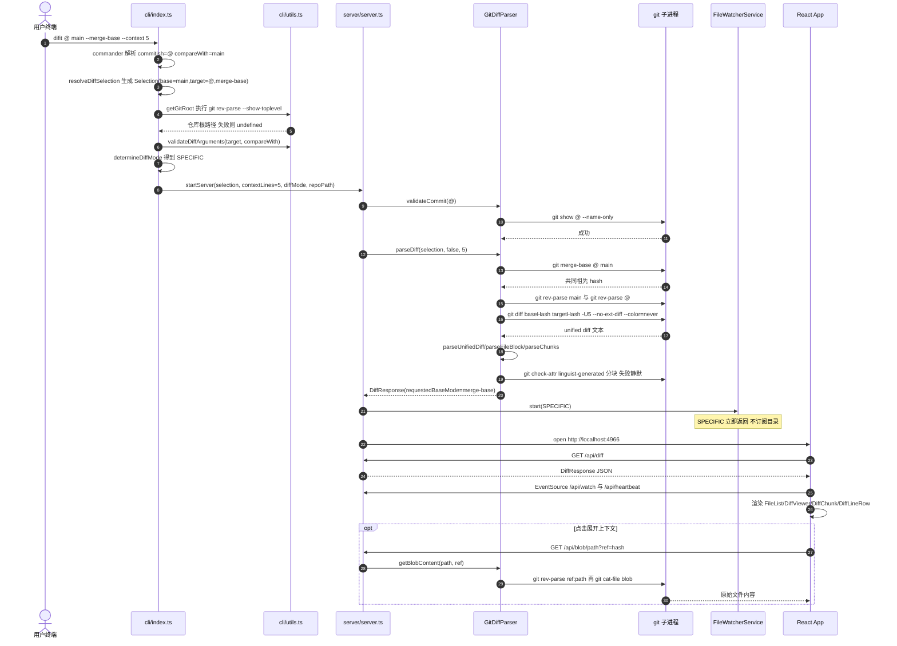
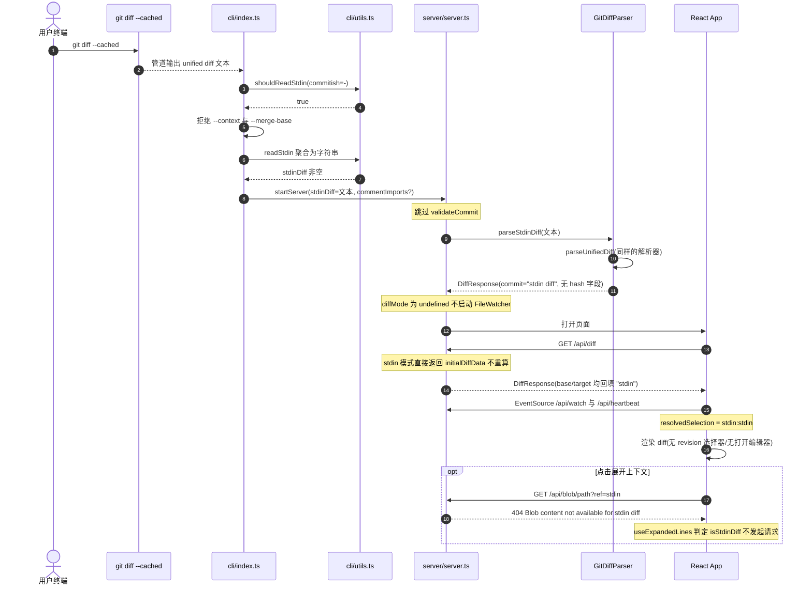
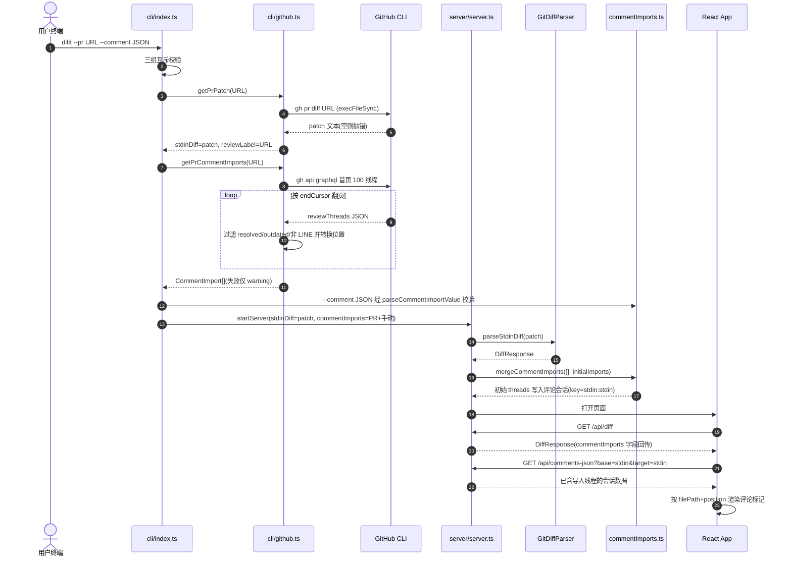

# difit 架构级代码走读（新成员版）

> 适用版本：当前工作区代码（2026-09 走读）。所有结论均标注来源文件与函数/类名。
> 标记约定：**[代码已确认]** 表示可直接在仓库代码中核对；**[合理推断]** 表示基于代码结构的推断，未被测试或注释直接证实。
> 三条主线命令：
>
> 1. `difit @ main --merge-base --context 5`（Git 版本对比模式）
> 2. `git diff --cached | difit -`（stdin diff 模式）
> 3. `difit --pr https://github.com/owner/repo/pull/123 --comment '<合法 JSON>'`（PR patch 模式）

---

## 0. 全局架构与进程模型

**[代码已确认]** difit 是单进程三模块结构，入口与模块边界如下：

- CLI 入口：`src/cli/index.ts` 的 commander `program`（`.action(...)` 回调起于 `src/cli/index.ts:130`）。负责参数解析、输入判定（Git / stdin / PR），然后调用 `startServer`。
- HTTP 服务：`src/server/server.ts` 的 `startServer`（`src/server/server.ts:124`），基于 Express。它同时承担：diff 数据 API、评论会话 API、SSE 推送、静态文件托管（生产模式托管 `dist/client`，见 `src/server/server.ts:1023` 附近 `express.static`）。
- Git 适配层：`src/server/git-diff.ts` 的 `GitDiffParser`（类定义 `src/server/git-diff.ts:14`）。所有 `git` 调用与 unified diff 解析集中在这里。
- 前端：`src/client/main.tsx` 挂载 `src/client/App.tsx` 的 `App`；`App` 通过 `fetch('/api/diff')` 拉数据，通过 `EventSource('/api/watch')`、`EventSource('/api/heartbeat')` 接收服务端事件。

**[代码已确认]** 三种输入模式在 `startServer` 内由 `options.stdinDiff` 这个布尔量分叉（`src/server/server.ts:162-189`）：

- 有 `stdinDiff`（命令 2、命令 3）：跳过 commit 校验，初始数据用 `parser.parseStdinDiff(...)` 解析字符串；`/api/diff` 永远返回同一份数据；blob / line-count / revisions / generated-status / open-in-editor 等 API 一律拒绝。
- 无 `stdinDiff`（命令 1）：启动前 `parser.validateCommit(...)`，初始数据用 `parser.parseDiff(...)` 实时跑 Git；前端可通过 query 切换 revision、展开上下文、打开编辑器。

核心数据结构（`src/types/diff.ts`）：

- `DiffSelection`（`src/types/diff.ts:35`）：`{ baseCommitish, targetCommitish, baseMode? }`，`baseMode` 取值 `'direct' | 'merge-base'`。
- `DiffResponse`（`src/types/diff.ts:40`）：`{ commit, files: DiffFile[], isEmpty?, baseCommitish?, targetCommitish?, requestedBaseCommitish?, requestedTargetCommitish?, requestedBaseMode?, repositoryId?, commentImports?, commentImportId?, clearComments?, ... }`。
- 文件/hunk/行：`DiffFile`（`src/types/diff.ts:1`）→ `DiffChunk`（`:10`）→ `DiffLine`（`:17`，`type: 'add' | 'delete' | 'normal' | ...`，带 `oldLineNumber/newLineNumber`）。

---

## 1. 命令一：`difit @ main --merge-base --context 5`

### 1.1 参数如何被解释

**[代码已确认]** positional 参数由 commander 声明（`src/cli/index.ts:100-109`）：第一个是 `[commit-ish]`（默认 `'HEAD'`），第二个是 `[compare-with]`。本条命令中 `commitish='@'`、`compareWith='main'`、`options.mergeBase=true`、`options.context=5`。

**[代码已确认]** `resolveDiffSelection`（`src/cli/index.ts:37`）在有 `compareWith` 时令 `baseCommitish='main'`、`targetCommitish='@'`，再调 `createDiffSelection(base, target, 'merge-base')`。`createDiffSelection`（`src/utils/diffSelection.ts:7`）在 merge-base 模式下显式写入 `baseMode: 'merge-base'`，否则省略该字段（消费侧用 `normalizeBaseMode` 把缺省视为 `'direct'`，`src/utils/diffSelection.ts:3`）。

**[代码已确认]** `--merge-base` 的一个前置校验在 CLI 层：若解析出的 base 是特殊关键字（`working/staged/.`，判定函数 `isSpecialArg`，`src/cli/index.ts:31`）则报错退出（`src/cli/index.ts:268-273`）。命令一的 base 是 `main`，该校验通过。

### 1.2 Mermaid 时序图

### 1.3 调用链清单（入口 / 关键函数 / 输入产出）

- 入口文件：`src/cli/index.ts`（commander action）。
- 输入判定：`resolveDiffSelection`（`src/cli/index.ts:37`）、`determineDiffMode`（`src/cli/index.ts:57`）。
  - **[代码已确认]** `determineDiffMode`：只要传了 `compareWith` 且 target 不是字面量 `HEAD` 也不是 `.`，就返回 `DiffMode.SPECIFIC`（`src/cli/index.ts:62-64`）。命令一 target 字符串是 `@`，因此落入 SPECIFIC。**[合理推断]** 这意味着即使语义上 target 就是当前 HEAD，文件监听也被关闭——这是字符串比较而非 rev-parse 语义比较带来的边界行为。
- 校验：`getGitRoot`（`src/cli/utils.ts:50`，执行 `git rev-parse --show-toplevel`，失败被 CLI catch 后令 `repoPath=undefined`，`src/cli/index.ts:258-264`）；`validateDiffArguments`（`src/cli/utils.ts:178`，内含"不能与自身比较""special 参数不能做 base"等规则）。
- 服务启动：`startServer`（`src/server/server.ts:124`）。输入 `{ selection, contextLines: 5, diffMode: SPECIFIC, repoPath }`；产出 `{ port, url, isEmpty, server }`。
- Diff 生成：`GitDiffParser.parseDiff`（`src/server/git-diff.ts:59`）。
  - merge-base 解析：`resolveBaseCommitish`（`src/server/git-diff.ts:49`）执行 `git merge-base <targetRef> <baseCommitish>`；特殊目标（`.`/`staged`/`working`）先由 `getMergeBaseTargetRef`（`src/utils/diffSelection.ts:42`）映射为 `HEAD`。
  - 双 commit 分支（`src/server/git-diff.ts:92-100`）：两次 `git rev-parse` 得短 hash，`diffArgs=[baseHash, targetHash]`；随后追加 `-w`（可选）、`-U5`（`contextLines`，`src/server/git-diff.ts:102-108`）、`--no-ext-diff --color=never`，最终单次 `this.git.diff(diffArgs)`。
  - 产出：`DiffResponse { commit: "base...target", files, isEmpty, baseCommitish, targetCommitish, requestedBaseCommitish:'main', requestedTargetCommitish:'@', requestedBaseMode:'merge-base' }`（`src/server/git-diff.ts:114-123`）。响应中的 `baseCommitish` 是**已解析的 merge-base 短 hash**，而 `requestedBaseCommitish` 保留用户原始输入。
- 文件/hunk/行创建点：`parseUnifiedDiff`（`src/server/git-diff.ts:131`）按 `diff --git ` 切块（无标记时退化到 `splitPlainUnifiedDiff`，`:153`）；`parseFileBlock`（`:460`）产出 `DiffFile`（路径解码、状态判定、增删行数）；`parseChunks`（`:536`）用正则 `@@ -a,b +c,d @@` 产出 `DiffChunk` 与逐行 `DiffLine`，并同步推进 old/new 行号（`:567-575`）。
- generated 文件标记：`markGitattributesGeneratedFiles`（`src/server/git-diff.ts:284`）通过 `git check-attr -z linguist-generated` 标记；整块调用失败时静默返回空集合（catch 位于 `:280-282`）。
- 前端消费：`App.fetchDiffData`（`src/client/App.tsx:690`）把响应存入 `diffData`；`resolvedSelection`（`src/client/App.tsx:155` 附近）用**解析后**的 `baseCommitish/targetCommitish` 重建 `DiffSelection`（带 `requestedBaseMode`），作为评论/已读状态的上下文键；渲染入口在 `src/client/App.tsx:1478` 的 `diffData.files.map`，经 `DiffViewer`（`src/client/components/DiffViewer.tsx`）→ `getViewerForFile`（`src/client/viewers/registry.ts:38`）选择文本/图片/Markdown/Notebook 渲染器 → 文本默认 `TextDiffViewer`（`src/client/viewers/TextDiffViewer.tsx:85` 渲染 mergedChunks）→ `DiffChunk`/`SideBySideDiffChunk` → `DiffLineRow`。
- blob 展开：前端 `useExpandedLines` 的 `fetchFileContent`（`src/client/hooks/useExpandedLines.ts:46`）请求 `/api/blob`；路由 `src/server/server.ts:495` → `GitDiffParser.getBlobContent`（`src/server/git-diff.ts:618`）：普通 ref 先 `git rev-parse <ref>:<path>` 再 `git cat-file blob <hash>`（`:664-673`），staged 用 `git show :<path>`（`:652-658`），工作区直接读文件系统并用 `realpath` 做越界校验（`:621-636`）。

### 1.4 Git 命令与失败处理（命令一）

**[代码已确认]**

| 调用点                                                | Git 命令                                                    | 失败处理                                                                                                                            |
| ----------------------------------------------------- | ----------------------------------------------------------- | ----------------------------------------------------------------------------------------------------------------------------------- |
| `getGitRoot`（`src/cli/utils.ts:50`）                 | `git rev-parse --show-toplevel`                             | CLI catch，`repoPath=undefined` 继续（回退 `process.cwd()`），不立即退出                                                            |
| `validateCommit`（`src/server/git-diff.ts:594`）      | 特殊值用 `git status`；否则 `git show <commit> --name-only` | 返回 false → `startServer` 抛 `Invalid or non-existent commit`（`src/server/server.ts:163-167`），CLI 最外层 catch 后 `exit(1)`     |
| `resolveBaseCommitish`（`src/server/git-diff.ts:55`） | `git merge-base`                                            | 被 `parseDiff` 的 try/catch 包成 `Failed to parse diff for ...`（`:124-128`）                                                       |
| `parseDiff`（`:94-110`）                              | `git rev-parse` ×2、`git diff`                              | `/api/diff` 路由再 catch 返回 500（`src/server/server.ts:316-323`）                                                                 |
| `getGitattributesGeneratedPaths`（`:256-283`）        | `git check-attr -z`                                         | 静默吞掉，按"无 generated 文件"处理                                                                                                 |
| `getBlobContent`（`:618`）                            | `git show` / `git rev-parse` / `git cat-file`               | 路由统一 404 `File not found`（`src/server/server.ts:540-542`）；超 10MB maxBuffer 转成可读错误（`src/server/git-diff.ts:677-682`） |

**[代码已确认]** 命令一不启动真实文件监听：`startServer` 仅在 `options.diffMode` 存在时调用 `fileWatcher.start`（`src/server/server.ts:1064-1071`），而 `FileWatcherService.start` 对 `DiffMode.SPECIFIC` 打印 disabled 后直接返回（`src/server/file-watcher.ts:71-75`），`MODE_WATCH_CONFIGS[SPECIFIC].watchPaths=[]`（`:44-46`）。
\*\*\* End Patch

---

## 2. 命令二：`git diff --cached | difit -`

### 2.1 输入判定：为什么 `-` 与"无参数管道"都走 stdin

**[代码已确认]** stdin 判定集中在 `shouldReadStdin`（`src/cli/utils.ts:37`），规则按顺序为：

1. `commitish === '-'` 直接返回 true（`src/cli/utils.ts:39-41`）。命令二的 `-` 就是 commander 的第一个 positional，因此命中此条，与 stdin 是不是 TTY 无关。
2. 有任何 positional 参数或有 `--pr` → false（`:43-45`）。
3. 否则用 `detectStdinSource`（`src/cli/utils.ts:13`，对 fd 0 做 `fstatSync`）判断：FIFO / 普通文件 / socket 为 true，TTY 为 false（`:47-49`）。所以无参数运行 `git diff | difit` 也会进入 stdin 模式，而交互终端直接敲 `difit` 不会。

**[代码已确认]** 读取动作是 `readStdin`（`src/cli/utils.ts:225`），把 `process.stdin` 的 Buffer 块拼成 UTF-8 字符串；空白内容会被 CLI 拒绝（`Error: No diff content received from stdin`，`src/cli/index.ts:219-222`）。

**[代码已确认]** stdin 分支的互斥校验（`src/cli/index.ts:210-223`）：`--context` 与 stdin 互斥（`:212-215`）；`--merge-base` 与 stdin 互斥（`:216-219`）。stdin 分支不会调用 `getGitRoot()`、`validateCommit()`，也不会计算 `DiffSelection`——`startServer` 收到的是 `{ stdinDiff, ... }` 而非 `selection`。

### 2.2 Mermaid 时序图

### 2.3 调用链清单与 stdin 数据的特殊形态

- 入口文件：`src/cli/index.ts`，`stdinDiff` 分支起于 `src/cli/index.ts:204`，`startServer` 调用在 `:230`。
- 解析：`GitDiffParser.parseStdinDiff`（`src/server/git-diff.ts:608`）只做一件事：`parseUnifiedDiff(diffContent)` 后返回 `{ commit: 'stdin diff', files, isEmpty }`。**[代码已确认]** 它与 Git 模式共用同一个 unified diff 解析器，因此文件/hunk/行结构完全一致；差异仅是没有任何 hash、没有 `git check-attr` generated 标记。
- 服务端回填：`/api/diff` 在 stdin 模式跳过缓存查询与 `parseDiff`（`src/server/server.ts:301` 的 `if (!options.stdinDiff)`），并把 `baseCommitish/targetCommitish` 回填为 `'stdin'`（`:344-353`）；评论上下文由 `createResolvedCommentSelection`（`:106`）统一归一为 `stdin:stdin`。
- 前端判定：`useExpandedLines` 用 `baseCommitish === 'stdin' || targetCommitish === 'stdin'` 计算 `isStdinDiff`（`src/client/hooks/useExpandedLines.ts:91`），`ensureFileContent`（`:115`）与 `prefetchFileContent`（`:345`）直接 return，不发 blob/line-count 请求。服务端也有第二道闸门：`/api/blob`（`src/server/server.ts:499-503`）、`/api/line-count`（`:449-452`）、`/api/generated-status`（`:374-377`）、`/api/revisions`（`:416-419`）、`/api/open-in-editor`（`:860-863`）在 stdin 模式分别返回 400/404。
- 能力开关：DiffResponse 里的 `openInEditorAvailable: !options.stdinDiff`（`src/server/server.ts:362`）通知前端隐藏"在编辑器中打开"。

### 2.4 与命令一的关键差异（stdin 模式）

**[代码已确认]**

- 不校验 Git 仓库、不校验 commit：`validateCommit` 被整段跳过（`src/server/server.ts:162-168` 的 `if (!options.stdinDiff)`）；CLI 层连 `getGitRoot()` 都不调用。
- 不读取 blob：上下文展开无数据源，前后端双重拦截（见 2.3）。
- 不监听文件：CLI 不传 `diffMode`（`src/cli/index.ts:230-239` 的 `startServer` 参数没有该字段），服务端 `if (options.diffMode)` 为假（`src/server/server.ts:1064`）。注意 SSE `/api/watch` 仍可连接，`addClient` 会回一个 `connected` 事件（`src/server/file-watcher.ts:201`），但没有任何订阅者会产生 `reload`。
- diff 不随 revision query 变化：`/api/diff` 恒返回初始解析结果，所以前端的 revision selector 数据也拿不到（`/api/revisions` 400）。
- 空白 diff 不报错退出：与"stdin 内容为空"不同，内容非空但解析不出文件时，`isEmpty=true`，服务照常启动但 CLI 提示"不自动打开浏览器"（`src/cli/index.ts:318-322`）。

---

## 3. 命令三：`difit --pr https://github.com/owner/repo/pull/123 --comment '<合法 JSON>'`

### 3.1 PR URL 如何变成 diff 文本与评论

**[代码已确认]** 入口仍是 `src/cli/index.ts` 的 action，`if (options.pr)` 分支起于 `:168`：

1. 三组互斥校验（`:170-187`）：positional 参数（除默认 HEAD 外）、`--merge-base`、`--context` 均与 `--pr` 互斥，违反即 `exit(1)`。
2. `getPrPatch(options.pr)`（`src/cli/github.ts:329`）同步执行 `execFileSync('gh', ['pr', 'diff', prArg])`。空 patch 抛错（`:335-337`）；任何失败经 `formatGhCommandError`（`:111`）把 stderr 暴露出来并追加 `Try: gh auth login`。CLI 对此是致命错误（`src/cli/index.ts:189-195`）。
3. `getPrCommentImports(options.pr)`（`src/cli/github.ts:376`）是异步分页拉取：
   - `parseGitHubPrUrl`（`:306`）从 URL pathname 解析 `owner/repo/pullNumber/hostname`，非法返回 null → `Invalid GitHub PR URL`（`:378-380`）。
   - 循环调用 `execFileSync('gh', ['api','graphql','--hostname', ...])` 执行内联 GraphQL（常量 `PR_REVIEW_THREADS_GRAPHQL_QUERY`，`:66` 起），每页 100 线程、每线程 100 评论，按 `pageInfo.hasNextPage/endCursor` 翻页（`:382-432`）。
   - 每个线程由 `toCommentImportsForThread`（`:225`）转换：已解决（isResolved）、过时（isOutdated）、非行级（subjectType !== 'LINE'）的线程整体跳过（`:226-228`）；位置由 `getThreadPosition`（`:199`）按 `diffSide` 分派到 `createRightSidePosition`（`:126`，映射 `line/startLine` 到 `side:'new'`）或 `createLeftSidePosition`（`:160`，映射 `originalLine/originalStartLine` 到 `side:'old'`）；线程首条评论生成 `type:'thread'`，其余生成 `type:'reply'`（`:261-303`）。坏数据逐条 `warnPrCommentImport` 跳过而不是整体失败。
   - **[代码已确认]** 评论拉取失败对主流程是非致命的：CLI 只打印 warning（`src/cli/index.ts:197-203`），patch 仍会展示。
4. 评论合并顺序：`commentImports = [...prCommentImports, ...manualCommentImports]`（`src/cli/index.ts:199`），即 PR 评论在前、`--comment` 手动注入在后；`--comment` 的 JSON 解析在更早处由 `parseCommentOptions`（`src/cli/utils.ts:168`）→ `parseCommentImportValue`（`src/utils/commentImports.ts:160`）完成，非法 JSON 直接 `exit(1)`（`src/cli/index.ts:153-159`）。

### 3.2 Mermaid 时序图

### 3.3 PR 模式调用链清单与评论落地路径

- 入口文件：`src/cli/index.ts:168-241`；GitHub 适配：`src/cli/github.ts`；JSON 校验与合并：`src/utils/commentImports.ts`。
- **[代码已确认]** PR patch 被赋给 `stdinDiff`（`src/cli/index.ts:189`），因此在服务端它与命令二走完全相同的"stdin 模式"路径：`parseStdinDiff`、无 blob、无 revision、无文件监听、评论上下文 `stdin:stdin`。两条命令唯一的输入侧差别是数据来源（`gh pr diff` vs 管道）与评论来源（GraphQL + `--comment`）。
- 评论如何进入会话：`startServer` 启动时执行 `mergeCommentImports([], initialCommentImports).threads`，若非空则写入 `commentSessions` 中 key 为 `createCommentSessionKey(currentCommentSelection)` 的会话（`src/server/server.ts:228-234`）。stdin/PR 模式该 key 即 `stdin:stdin:direct`（`getDiffSelectionKey`，`src/utils/diffSelection.ts:37`）。
- 浏览器如何看到评论：`App` 挂载后先从 localStorage 取本上下文评论，再通过 bootstrap effect 调 `fetchServerThreads()`（`src/client/App.tsx:252`、`:905-960`），与本地数据做 `mergeCommentThreads` 后 `replaceThreads`；因此服务端预置的 PR 线程会合并进 UI 并回写 localStorage。
- DiffResponse 上的 `commentImports/commentImportId` 字段（`src/server/server.ts:364-368`）：**[代码已确认]** 仅在 stdin 模式或请求 selection 等于初始 selection 时回传；**[合理推断]** 当前生产前端 `App.tsx` 并不读取这两个字段（全仓搜索仅见类型定义与测试引用，见 `src/server/server.test.ts:657`），真正让 PR 评论出现的是上面的服务端会话 + bootstrap 路径；该字段更像为外部/站点消费方保留的数据出口。
- `--comment` 合法性由谁保证：`normalizeCommentImports`（`src/utils/commentImports.ts:145`）逐字段校验 `type/filePath/position.side/position.line/body` 与时间戳格式（`:34-135`），任何字段非法即抛错，在 CLI 启动阶段终止进程。

---

## 4. 三种模式差异总表

**[代码已确认]** 下表每一行的结论均可在标注函数处核对。

| 维度                                              | 普通 Git diff（命令一）                                                                        | stdin diff（命令二）                                                              | PR patch（命令三）                                                                                                                                         |
| ------------------------------------------------- | ---------------------------------------------------------------------------------------------- | --------------------------------------------------------------------------------- | ---------------------------------------------------------------------------------------------------------------------------------------------------------- |
| 入口判定                                          | 无 `--pr` 且 `shouldReadStdin` 为 false（`src/cli/utils.ts:37`）                               | `commitish==='-'` 或无 positional 且 stdin 是 pipe/file/socket                    | `options.pr` 为真（`src/cli/index.ts:168`）                                                                                                                |
| 是否要求 Git 仓库                                 | 要求可解析 diff；但 `getGitRoot` 失败不退出，回退 cwd（`src/cli/index.ts:258-264`）            | 不要求，完全不探测仓库                                                            | 不要求本地仓库；但要求外部 `gh` 已安装并登录                                                                                                               |
| 是否校验 commit                                   | 是，`validateCommit`（`src/server/git-diff.ts:594`），启动前失败即抛错                         | 否                                                                                | 否                                                                                                                                                         |
| diff 数据来源                                     | `git diff` 实时执行（`src/server/git-diff.ts:123`）                                            | `parseStdinDiff` 解析字符串（`:608`）                                             | `gh pr diff` 取 patch（`src/cli/github.ts:329`）后同样走 `parseStdinDiff`                                                                                  |
| `--context`                                       | 支持，转成 `git diff -U<n>`（`:104-106`）                                                      | 互斥，报错退出（`src/cli/index.ts:212-215`）                                      | 互斥，报错退出（`:180-183`）                                                                                                                               |
| `--merge-base`                                    | 支持，额外执行 `git merge-base`（`src/server/git-diff.ts:55`）                                 | 互斥（`src/cli/index.ts:216-219`）                                                | 互斥（`:175-178`）                                                                                                                                         |
| blob 展开上下文                                   | 支持：`/api/blob` → `git cat-file`/文件系统                                                    | 双重拒绝：前端不请求（`useExpandedLines.ts:91,115`），后端 404（`server.ts:499`） | 同 stdin（patch 无对应 blob 源）                                                                                                                           |
| 评论上下文 key                                    | `解析后base:解析后target:baseMode`（服务端 `createResolvedCommentSelection`，`server.ts:106`） | `stdin:stdin:direct`                                                              | `stdin:stdin:direct`（**[合理推断]** 两个不同 PR 共用该 key，服务端会话不按 PR URL 隔离；浏览器 localStorage 也同样不隔离，仅靠 `--clean` 或手动清除区分） |
| 评论初始来源                                      | `--comment`（可选）                                                                            | `--comment`（可选）                                                               | PR review threads（GraphQL）+ `--comment`，PR 拉取失败仅 warning                                                                                           |
| 文件监听                                          | 取决于 `DiffMode`：SPECIFIC 不监听；DEFAULT/WORKING/STAGED/DOT 监听（`file-watcher.ts:20-46`） | 不启动（不传 `diffMode`）                                                         | 不启动（同 stdin 路径）                                                                                                                                    |
| revision 切换 / open-in-editor / generated-status | 支持                                                                                           | 全部 400/404 或隐藏                                                               | 同 stdin                                                                                                                                                   |
| 浏览器自动打开                                    | diff 为空时不打开（`server.ts:1075-1079`）                                                     | 同左                                                                              | 同左                                                                                                                                                       |

---

## 5. `--merge-base`、`--context`、`--pr`、stdin、positional 的互斥规则全集

每条规则给出**负责校验的真实文件与函数**。

1. **`--context` 必须是非负整数**：`src/cli/index.ts` 的 action 开头（`:142-147`），负数/非整数 → `exit(1)`。
2. **`--pr` 不得带 positional 参数**：仅当 `commitish !== 'HEAD'`（被显式传入）或存在 `compareWith` 时报错（`src/cli/index.ts:170-174`）。即默认值 HEAD 不算冲突。
3. **`--pr` 不得与 `--merge-base` 同用**：`src/cli/index.ts:175-178`。
4. **`--pr` 不得与 `--context` 同用**：`src/cli/index.ts:180-183`。
5. **stdin 不得与 `--context` 同用**：判定函数 `shouldReadStdin`（`src/cli/utils.ts:37`）+ 拒绝点 `src/cli/index.ts:212-215`。
6. **stdin 不得与 `--merge-base` 同用**：`src/cli/index.ts:216-219`。
7. **positional 参数会关闭"自动 stdin 探测"**：`shouldReadStdin` 中 `hasPositionalArgs` 为真即 false（`src/cli/utils.ts:43-45`）。但显式 `-` 不受此限（`:39-41` 优先级最高），所以 `difit -` 永远走 stdin，即便它形式上是个 positional。
8. **`--pr` 与自动 stdin 探测互斥**：`hasPrOption` 为真即 false（`src/cli/utils.ts:43-45`）；且 CLI 只在 `else`（无 PR）分支调用 `shouldReadStdin`（`src/cli/index.ts:204-206`），因此 `... | difit --pr URL` 不会读取管道。
9. **`--merge-base` 要求 base 是真实 commit-ish**：CLI 层拒绝 special base（`src/cli/index.ts:268-273`，判定 `isSpecialArg`，`:31`）；语义解析在服务端 `GitDiffParser.resolveBaseCommitish`（`src/server/git-diff.ts:49`），非法 ref 会在执行 `git merge-base` 时失败。
10. **positional 自身合法性**：`validateDiffArguments`（`src/cli/utils.ts:178`）+ `validateCommitish`（`:62`）：
    - target/base 格式必须通过 SHA / HEAD / `@` / 分支名校验（`isValidCommitishBase`、`isValidBranchName`，`:79-146`）；
    - special 参数（`working/staged/.`）只能做 target，唯一例外是 `working` 对 `staged`（`:190-201`）；
    - target 与 base 相同拒绝（`:204-210`）；
    - `working` 作为 target 时 base 只能是 `staged`（`:213-220`）。
11. **stdin 内容不得为空白**：`readStdin` 后的非空检查（`src/cli/index.ts:219-222`）。
12. **`--comment` 必须是合法 JSON 且字段合法**：`parseCommentOptions`（`src/cli/utils.ts:168`）→ `parseCommentImportValue`/`normalizeCommentImports`（`src/utils/commentImports.ts:160,145`），失败在 `src/cli/index.ts:153-159` 终止。
13. **`--pr` 的 URL 必须可解析**：`parseGitHubPrUrl`（`src/cli/github.ts:306`）返回 null 时 `getPrCommentImports` 抛 `Invalid GitHub PR URL`（`:378-380`）；但注意 `getPrPatch` 直接把原始参数传给 `gh pr diff`，URL 合法性最终也由 gh 兜底（**[合理推断]**，`src/cli/github.ts:329-343`）。
14. **子命令与主命令互斥（结构层面）**：`difit comment add/get/resolve` 是独立子命令（`createCommentCommand`，`src/cli/comment.ts:37`；注册于 `src/cli/index.ts:97`），不启动服务，只通过 HTTP 操作已运行的服务器。

**[合理推断]** 没有规则阻止 `--pr` 与 `--clean`、`--include-untracked`、`--keep-alive`、`--background` 同用；后两者经后台分支（`startBackgroundProcess`，`src/cli/background.ts:38`）时会被强制追加 `--keep-alive --no-open`（`src/cli/background.ts:50-56`）。

---

## 6. 请求数据生命周期表

**[代码已确认]** 以下字段沿"CLI 来源 → 服务端转换 → HTTP 响应 → 前端消费"追踪。

| 字段                                                      | 初始来源                                                                                                                                          | 关键转换位置                                                                                                                                                                                                                              | 前端最终消费者                                                                                                                                                                     |
| --------------------------------------------------------- | ------------------------------------------------------------------------------------------------------------------------------------------------- | ----------------------------------------------------------------------------------------------------------------------------------------------------------------------------------------------------------------------------------------- | ---------------------------------------------------------------------------------------------------------------------------------------------------------------------------------- |
| `baseCommitish`（DiffSelection）                          | positional `[compare-with]`，或默认推导（`resolveDiffSelection`，`src/cli/index.ts:37`）                                                          | `parseDiff` 中 rev-parse / merge-base 成短 hash（`src/server/git-diff.ts:75-100`）；stdin 回填 `'stdin'`（`server.ts:344-346`）                                                                                                           | `App.resolvedSelection`（`src/client/App.tsx:155`）→ 评论/已读 localStorage 键、`/api/blob?ref=`、评论 API query                                                                   |
| `targetCommitish`                                         | positional `[commit-ish]`，默认 `'HEAD'`                                                                                                          | 同上，短 hash 或 `'stdin'`                                                                                                                                                                                                                | 同上；revision selector 显示（`resolvedTargetRevision`，`App.tsx:730`）                                                                                                            |
| `requestedBaseCommitish` / `requestedTargetCommitish`     | 用户原始输入，未经解析                                                                                                                            | `parseDiff` 原样挂到响应（`src/server/git-diff.ts:119-120`）                                                                                                                                                                              | 初始化 `selectedRevision`（`App.tsx:733-740`），让 selector 显示 `@`/`main` 而非 hash                                                                                              |
| `baseMode`（direct/merge-base）                           | `--merge-base` 标志                                                                                                                               | `createDiffSelection`（`diffSelection.ts:7`）→ 响应 `requestedBaseMode`（`git-diff.ts:65-66,121`）→ 评论 query 与存储键                                                                                                                   | `App` 拼 `commentSessionQueryString`（`App.ts:226-235`）；StorageService key 后缀 `-merge-base`（`StorageService.ts:75-76`）                                                       |
| `repositoryId`                                            | `startServer` 对仓库绝对路径做 SHA-256（`server.ts:126-127`）                                                                                     | 原样挂到每次 `/api/diff` 响应（`:361`）                                                                                                                                                                                                   | localStorage 命名空间前缀（`useDiffComments` 入参，`App.ts:211`；`StorageService.getFullStorageKey`，`:82-88`）                                                                    |
| `commit`                                                  | `parseDiff` 拼出的展示串（`shortHash(base)+'...'+shortHash(target)`，`createCommitRangeString`，`src/cli/utils.ts:157`）；stdin 为 `'stdin diff'` | 不转换                                                                                                                                                                                                                                    | 作为 `currentCommitHash` 传给 `useDiffComments`/`useViewedFiles`（`App.ts:209,290`），用于把 HEAD 类符号引用归一化为 hash 存储键（`StorageService.normalizeCommitish`，`:93-122`） |
| `files: DiffFile[]`                                       | `git diff`/stdin/gh patch 的 unified diff 文本                                                                                                    | `parseUnifiedDiff`→`parseFileBlock`→`parseChunks`（`git-diff.ts:131,460,536`）；generated 标记（`:284`）                                                                                                                                  | `App.tsx:1478` 列表 → `DiffViewer` → `TextDiffViewer`/图片/Markdown/Notebook（`registry.ts:38`）                                                                                   |
| `DiffChunk.lines: DiffLine[]`                             | hunk 头正则 + 逐行首字符（+/−/空格）                                                                                                              | `parseChunks`（`git-diff.ts:536-588`）；展开上下文时由前端 `getExpandedChunk` 注入 `isExpanded` 的 normal 行（`useExpandedLines.ts:411` 起）                                                                                              | `DiffChunk`/`SideBySideDiffChunk` → `DiffLineRow`；mergedChunks 由 `buildMergedChunksState`（`App.tsx:460-469`）组装                                                               |
| `comments`（运行期为 `threads`）                          | `--comment` JSON；PR GraphQL；`difit comment add`；UI 输入                                                                                        | CLI：`normalizeCommentImports`；服务端：`mergeCommentImports`/`mergeCommentThreads`（`commentImports.ts:480,414`）存入内存 `commentSessions`（`server.ts:216-244`）；客户端：localStorage `DiffContextStorage`（`StorageService.ts:153`） | `useDiffComments.threads`（`useDiffComments.ts:77`）→ `DiffChunk` 内 `CommentThreadCard`/`CommentForm`；SSE `commentsChanged` 触发跨标签刷新（`useFileWatch.ts:64-68`）            |
| `commentImports` / `commentImportId`（DiffResponse 字段） | 启动参数 `options.commentImports`；id 是序列化内容的 SHA-256（`server.ts:132-136`；`serializeCommentImports`，`commentImports.ts:467`）           | 仅在匹配初始 selection 时随 `/api/diff` 回传（`server.ts:299-300,364-368`）                                                                                                                                                               | **[代码已确认]** 生产 `App.tsx` 未读取（无引用）；测试 `server.test.ts:657` 断言其存在                                                                                             |
| `contextLines`                                            | `--context <n>`                                                                                                                                   | CLI 非负校验（`index.ts:142`）；服务端作为进程级参数传入每次 `parseDiff`（`server.ts:309`）并转成 `-U<n>`                                                                                                                                 | 间接决定 `files[].chunks` 的 hunk 大小；无独立前端字段                                                                                                                             |
| `ignoreWhitespace`                                        | 前端状态，初值 `true`（`App.ts:117`）                                                                                                             | query `?ignoreWhitespace=true`（`App.tsx:705`）→ 服务端追加 `git diff -w`（`git-diff.ts:102-104`）；缓存键含该位（`server.ts:57`）                                                                                                        | 仅作为请求参数；响应回显同名字段                                                                                                                                                   |
| `clearComments`                                           | `--clean` CLI 标志                                                                                                                                | 原样进 `/api/diff` 响应（`server.ts:360`）                                                                                                                                                                                                | `App` 的清洁 effect 调 `clearAllComments`+`clearViewedFiles`（`App.ts:893-903`）                                                                                                   |
| `openInEditorAvailable`                                   | 服务端按 `!stdinDiff` 计算（`server.ts:362`）                                                                                                     | 无                                                                                                                                                                                                                                        | 控制编辑器按钮可见性（**[合理推断]** 由 `DiffViewerHeader`/`OpenInEditorButton` 消费）                                                                                             |
| SSE 事件                                                  | 文件变更 / 评论变更 / 心跳                                                                                                                        | `FileWatcherService.broadcast`（`file-watcher.ts:216`）；心跳由 `/api/heartbeat` 每 5s 发送（`server.ts:998-1001`）                                                                                                                       | `useFileWatch`（`useFileWatch.ts:42-122`）显示 reload 按钮；断线 5 次后停止重连                                                                                                    |

---

## 7. 容易被新开发者误解的边界点

### 7.1 merge-base 的状态隔离靠三处同步的字符串约定

**[代码已确认]** merge-base 与普通对比的评论/已读状态是隔离的，但隔离分散在三个地方，必须同时成立：

- 服务端会话键：`getDiffSelectionKey` 输出 `base:target:normalizeBaseMode(baseMode)`（`src/utils/diffSelection.ts:37-39`），并由 `createResolvedCommentSelection`（`src/server/server.ts:106`）用**解析后**的 merge-base hash 作为 base。
- 前端 localStorage 键：`StorageService.generateStorageKey` 对 merge-base 追加 `-merge-base` 后缀（`src/client/services/StorageService.ts:69-78`）。
- 前端 API query：`App` 仅在 baseMode 为 merge-base 时附带 `baseMode=merge-base`（`src/client/App.tsx:226-235`），服务端 `getCommentSelectionFromQuery` 据此重建 selection（`src/server/server.ts:258-275`）。

若误改（例如去掉 storage 后缀、或在 query 缺省时默认成 direct），用户可见问题：对同一对 `main vs @` 分别用普通模式与 merge-base 模式审查时，评论串台——评论会出现在错误的行号上，因为两种模式的 base hash 不同，而前端评论定位完全依赖行号。

### 7.2 stdin 模式的 blob 请求是"双保险"，删任何一层都会出问题

**[代码已确认]** 前端 `useExpandedLines` 用 `isStdinDiff` 短路（`src/client/hooks/useExpandedLines.ts:91,115,345`），后端五个 API 又各自对 `options.stdinDiff` 返回 400/404（`src/server/server.ts:374,416,449,499,860`）。

误改后果：

- 只删前端判断：stdin/PR 审查时点"展开上下文"会发请求，收到 404 后 `console.error` 且展开无反应（错误被 catch 成空数组，`:130-133`），用户看到按钮转完什么都没发生。
- 只删后端判断：`getBlobContent` 会在"仓库"里去找 patch 中虚构的 ref（stdin 模式 ref 为 `'stdin'`），`git rev-parse stdin:path` 必然失败；更糟的是工作区分支会尝试按相对路径读磁盘文件，可能把与 patch 无关的本地同名文件内容展示成"历史版本"，造成误导。

### 7.3 diff 缓存的失效只依赖文件监听回调

**[代码已确认]** `/api/diff` 结果缓存在进程内 LRU（`MAX_DIFF_CACHE_ENTRIES=8`，`src/server/server.ts:53-84`），键只含 selection 与 ignoreWhitespace（`createDiffCacheKey`，`:56-58`），**不含 contextLines**（contextLines 是进程级启动参数，运行期不变）。缓存清空发生在：文件监听回调 `invalidateCache`（`:182-186`，同时清 generated 缓存和 resolvedCommit 缓存）、以及缓存未命中写入新响应时顺带清 generated 缓存（`:315`）。

误改后果：若把 watcher 的 `onCacheInvalidate` 传丢或改错键，`difit .` / `difit`（DEFAULT/DOT 模式）下用户提交新改动后点页面 reload，仍看到旧 diff，直到重启进程。反向地，SPECIFIC 模式（命令一）不启动 watcher 是**有意的**——commit-to-commit 的 diff 内容不可变，不需要失效。

附带一个易误解点：`resolvedCommitCache` 有 5 秒 TTL（`RESOLVED_COMMIT_CACHE_TTL_MS`，`src/server/git-diff.ts:18`），revision selector 解析分支名时可能在 5 秒窗口内拿到旧短 hash（`resolveCommitish`，`:704`）；这是为延迟做的取舍，不要误删。

### 7.4 路径校验是防目录穿越的安全边界，且存在两份实现

**[代码已确认]** 服务端 HTTP 层 `parseRepositoryRelativePath`（`src/server/server.ts:201-222`）拒绝绝对路径、前导 `/`、任何 `..` 段，并对 `resolve(repoPath, filepath)` 做前缀校验；`GitDiffParser.normalizeRepositoryRelativePath`（`src/server/git-diff.ts:25-42`）有一份等价实现；工作区 blob 读取还用 `fs.realpathSync` 防 symlink 逃逸（`:626-635`）。

误改后果：`/api/blob/<path>` 会变成任意文件读取原语（`git cat-file` 分支虽然受 ref:path 约束，但工作区分支是直接读盘的）；`/api/open-in-editor`（`:858` 起）也会用越界路径拼接编辑器命令参数。改这部分时必须同时保留字符串校验与 resolve 前缀校验两层——只防 `..` 字符串挡不住某些 symlink/盘符场景（**[合理推断]**，这也是工作区分支额外做 realpath 的原因）。

### 7.5 `difit .` 与 `difit working` 的 untracked 处理会改动 Git 索引（但只加 intent-to-add）

**[代码已确认]** 仅 target 为 `working` 或 `.` 时，CLI 会 `findUntrackedFiles`（`git status` 的 `not_added`，`src/cli/utils.ts:221`）并交互询问；同意后执行 `git add --intent-to-add`（`markFilesIntentToAdd`，`src/cli/utils.ts:226`；调用点 `src/cli/index.ts:275-281,342-366`）。后台子进程且未传 `--include-untracked` 时跳过交互（`src/cli/index.ts:276-279`）。

误改后果：若把 intent-to-add 改成普通 `git add`，用户审查一个 diff 就会意外把文件内容真正暂存，污染 `git diff --cached`；若在 SPECIFIC/PR 模式也触发该流程，则在用户只想看历史 commit 时改动工作区索引。CLI 输出的撤销提示 `git reset -- <files>`（`:347`）依赖这里只加了 intent-to-add 标志这一前提。

### 7.6 心跳断连即退出进程，keep-alive / background 依赖这条链

**[代码已确认]** `/api/heartbeat` 在连接 close 时，若未开 `--keep-alive` 会延迟 100ms 调用 `outputFinalComments()` 后 `process.exit(0)`（`src/server/server.ts:1006-1019`）。`--background` 父进程派生的子进程会强制 `keepAlive=true`、`open=false`（`src/cli/index.ts:161-163`；`src/cli/background.ts:50-56`）。

误改后果：若让心跳在非 keep-alive 下也不退出，CLI 会残留端口占用（下一次启动靠 `startServerWithFallback` 递增端口，`:1095` 起，用户会发现自己在 4967、4968 上越攒越多进程）；若反过来在 background 子进程也退出，`difit --background` 输出 JSON 握手信息（`emitBackgroundHandshake`，`src/cli/background.ts:24`）后守护进程立刻死亡。

### 7.7 `@` 作为 target 与字面量 `HEAD` 走不同的监听模式

**[代码已确认]** `determineDiffMode` 用字符串字面量比较 `targetCommitish !== 'HEAD'`（`src/cli/index.ts:62-64`），`@` 虽是 HEAD 的 Git 别名，但在带 `compareWith` 时同样被归入 SPECIFIC。

误改后果：若有人"优化"成先 rev-parse 再比较，`difit @ main` 会被误判成需要监听 HEAD 变化的模式，产生无意义的 reload 提示；更重要的是单参数 `difit @`（无 compareWith）当前落入 DEFAULT 监听模式（target 不是 `working/staged/.`，`:69-75`），改动这里会同时改变单参数默认行为。

---

## 8. 新成员推荐阅读顺序

建议按下面顺序读，每一步都建立在前一步的概念上。

1. `src/types/diff.ts` — 先建立数据词汇表：`DiffSelection`、`DiffResponse`、`DiffFile/DiffChunk/DiffLine`、`DiffCommentThread`、`DiffContextStorage`。前置知识：无。
2. `src/utils/diffSelection.ts` — 全仓最小的核心文件：`createDiffSelection`/`normalizeBaseMode`/`getDiffSelectionKey`。理解"direct 是缺省值、merge-base 要显式"和评论隔离键格式。前置：第 1 步的 `DiffSelection`。
3. `src/cli/utils.ts` — 输入侧规则集：`shouldReadStdin`/`detectStdinSource`、`getGitRoot`、`validateCommitish`/`validateDiffArguments`、`readStdin`。前置：Git revision 基本概念。
4. `src/cli/index.ts` — 主命令编排：读 `resolveDiffSelection`、`determineDiffMode` 和 action 中 PR/stdin/Git 三条分叉，对照本文第 5 节互斥规则逐条看。前置：第 2、3 步。
5. `src/cli/github.ts` — PR 模式适配：`getPrPatch`、GraphQL 查询常量、`getThreadPosition` 的左右侧映射、`toCommentImportsForThread` 的过滤规则。前置：`CommentImport` 类型。
6. `src/server/git-diff.ts` — 后端核心：先读 `parseDiff`（四种 target 分支与参数拼装），再读 `parseUnifiedDiff`/`parseFileBlock`/`parseChunks`，最后读 `getBlobContent` 与 `validateCommit`。前置：unified diff 格式（hunk 头 `@@ -a,b +c,d @@`）。
7. `src/server/server.ts` — 装配层：`startServer` 开头的 stdin 分叉与缓存结构 → `/api/diff` 路由 → 评论会话几个路由 → blob/line-count 的 stdin 闸门与路径校验 → `/api/watch`、`/api/heartbeat`。文件较长，建议按路由分段读。前置：第 4、6 步。
8. `src/server/file-watcher.ts` — 配合 `src/types/watch.ts` 的 `DiffMode` 枚举读 `MODE_WATCH_CONFIGS`、`isRelevantGitFile`、`debouncedBroadcast`，理解什么改动会触发前端 reload。前置：Express SSE 基本概念。
9. `src/utils/commentImports.ts` — 评论数据的校验（`normalizeCommentImports`）与三路合并（`mergeCommentImports` 处理导入、`mergeCommentThreads` 处理并发写入）。前置：`DiffCommentThread` 类型。
10. `src/client/App.tsx` — 前端总装配，重点看：`fetchDiffData`（690 行）、`resolvedSelection` 与两个 context key（155、214、226 行附近）、评论 bootstrap effect（905 行起）、SSE 两个 effect（1020、1031 行）、文件渲染循环（1478 行）。前置：第 7 步的 API 形态。
11. `src/client/hooks/useExpandedLines.ts` — 理解"blob 展开上下文"如何在前端把完整文件内容切片合并回 chunk；注意 `isStdinDiff` 短路。前置：第 6 步的 blob 路由。
12. `src/client/services/StorageService.ts` — localStorage 的仓库隔离（repositoryId）、HEAD→hash 归一化、merge-base 后缀、v1→v2 迁移。前置：第 2、9 步。
13. `src/client/hooks/useFileWatch.ts` + `src/client/components/DiffChunk.tsx` + `src/client/viewers/TextDiffViewer.tsx` + `src/client/viewers/registry.ts` — 最后看渲染与交互：SSE 重连、chunk/行渲染、viewer 分派。前置：React hooks 基础。
14. （可选进阶）`src/cli/comment.ts` 与 `src/cli/background.ts` — 独立子命令如何复用同一套评论 API；后台守护进程的 spawn/握手协议。前置：第 7、9 步。

配套测试可作为"可执行文档"：`src/server/git-diff.test.ts`、`src/server/server.test.ts`、`src/cli/github.test.ts`、`src/utils/commentImports.test.ts`、`src/client/hooks/repositoryIsolation.integration.test.ts`。

---

## 9. 验证记录

验证环境：Windows 11，Node v24.14.1，pnpm 11.6.0（经 corepack 提供）。本次改动仅新增 `docs/architecture-code-walkthrough.md`，未修改任何生产代码；验证前工作区缺少 `node_modules`，先执行了 `corepack pnpm install`（环境准备，非代码改动）。

| 命令                                                               | 结果 | 备注                                                                                                                                                                                        |
| ------------------------------------------------------------------ | ---- | ------------------------------------------------------------------------------------------------------------------------------------------------------------------------------------------- |
| `pnpm test`（实际 `corepack pnpm test`，vitest run）               | 通过 | Test Files 63 passed；Tests 860 passed / 2 skipped；耗时约 21s。输出尾部有 happy-dom 卸载时的 `AbortError/NetworkError` 堆栈，来自测试环境 iframe/fetch 清理，不影响结果（退出码 0）        |
| `pnpm check`（oxlint `--type-aware --type-check --deny-warnings`） | 通过 | 无告警无错误，退出码 0                                                                                                                                                                      |
| `pnpm build`（`build:cli` tsc + `vite build`）                     | 通过 | 退出码 0；仅有 chunk 体积 >500kB 的常规优化提示（非失败）。执行时因 Node 安装目录不可写、无法 `corepack enable`，使用了转发到 `corepack pnpm` 的用户目录 shim 注入 PATH，构建本身与代码无关 |

**[代码已确认]** 三条命令均未失败；未出现需要归因于环境或本次文档改动的失败项。（`pnpm build` 首次裸跑时报 `'pnpm' is not recognized`，原因是子 shell PATH 上没有 pnpm shim，属本机环境配置问题，加入 shim 后通过，与本次文档改动无关。）
